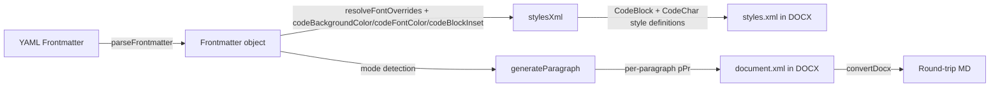

# Design Document: Code Block Styling

## Overview

This feature replaces the current indentation-based code block styling in the Word document generator (`md-to-docx.ts`) with a shading+border approach that produces visually uniform colored code regions. The key insight is that OOXML's `w:shd` (paragraph shading) does not extend into `w:ind` (indent) areas, so the current approach cannot produce a filled background. Instead, we use color-matched `w:pBdr` borders with `w:space` to create inset padding within a uniformly shaded block.

Two new YAML frontmatter fields (`code-background-color`, `code-font-color`) control the behavior. By default, shading mode is active with a default background color. Setting `code-background-color` to `none` or `transparent` falls back to the existing indentation-based inset mode. A third field (`code-block-inset`) allows overriding the default border width (`w:sz`) for code blocks in shading mode. The parser also accepts `code-background` and `code-color` as aliases for `code-background-color` and `code-font-color` respectively; the serializer always emits the canonical names.

Inline code regions (backtick-delimited `` `code` ``) share the same background and text colors as code blocks. The `CodeChar` character style receives `w:shd` (background) and `w:color` (text) in its `w:rPr`, matching the CodeBlock style's colors. The `code-block-inset` field does not affect inline code.

The changes are confined to:
- `src/frontmatter.ts` — parse/serialize the three new fields (with aliases)
- `src/md-to-docx.ts` — conditional style generation (CodeBlock + CodeChar) and paragraph emission
- `src/converter.ts` — round-trip preservation of the new frontmatter fields
- `docs/specification.md` — document the three new frontmatter fields

## Architecture

The feature follows the existing architecture with no new modules or abstractions. The data flow is:



### Mode Selection Logic

```mermaid
flowchart TD
    A[Read code-background-color from Frontmatter] --> B{Value?}
    B -->|"none" or "transparent"| C[Inset Mode: w:ind, no shading]
    B -->|Valid 6-digit hex| D[Shading Mode: w:shd + w:pBdr with that color]
    B -->|Absent or invalid| E[Shading Mode: w:shd + w:pBdr with default color]
```

### Design Decisions

1. **Style-based, not inline**: All code block formatting lives in the named `CodeBlock` style in `styles.xml`. Per-paragraph XML only references the style by name. This keeps the document clean and allows users to modify the style in Word.

2. **Border color matches shading**: The `w:pBdr` border color is set to the same hex as `w:shd` fill, making the border visually invisible while its `w:space` attribute provides the inset padding. This is the standard OOXML technique for padded shaded regions.

3. **Spacing overrides only in inset mode**: In shading mode, all code paragraphs get identical `w:pPr` (just the style reference). The style itself defines `w:spacing w:after="0"`. In inset mode, the existing first/last paragraph `w:before`/`w:after` overrides are preserved for visual padding.

4. **`stylesXml` receives code block config**: Rather than adding a new parameter type, we extend the existing `FontOverrides` interface (or pass frontmatter directly) to carry `codeBackgroundColor`, `codeFontColor`, and `codeBlockInset` into `stylesXml()`. This keeps the change minimal.

5. **Inline code shares colors with code blocks**: The `CodeChar` character style receives the same `w:shd` background and `w:color` text color as the `CodeBlock` paragraph style. This is done at the style level in `styles.xml`, so inline code runs only need `<w:rStyle w:val="CodeChar"/>` — no per-run inline formatting. In inset mode, `CodeChar` has no `w:shd` (matching the absence of background on code blocks).

6. **`code-block-inset` is code-block-only**: The `code-block-inset` field controls `w:sz` on `w:pBdr` borders, which is a paragraph-level concept. It does not apply to inline code since `CodeChar` is a character style with no paragraph borders.

7. **Canonical names with aliases**: The frontmatter fields use `code-background-color` and `code-font-color` as canonical names. The parser also accepts `code-background` and `code-color` as aliases for backward compatibility. The serializer always emits the canonical names. When both a canonical name and its alias appear in the same frontmatter block, the canonical name takes precedence.

## Components and Interfaces

### Modified: `Frontmatter` interface (`src/frontmatter.ts`)

Add three optional fields:

```typescript
export interface Frontmatter {
  // ... existing fields ...
  codeBackgroundColor?: string;  // 6-digit hex (e.g. "E8E8E8"), "none", or "transparent"
  codeFontColor?: string;        // 6-digit hex (e.g. "2E2E2E")
  codeBlockInset?: number;       // positive integer, w:sz in eighths of a point
}
```

### Modified: `parseFrontmatter()` (`src/frontmatter.ts`)

Add cases for both canonical names and aliases:
- `case 'code-background-color'` and `case 'code-background'` → `codeBackgroundColor`
- `case 'code-font-color'` and `case 'code-color'` → `codeFontColor`
- `case 'code-block-inset'` → `codeBlockInset`

Validation:
- `code-background-color` / `code-background`: accept 6-digit hex (`/^[0-9A-Fa-f]{6}$/`), `none`, or `transparent`. Ignore invalid values.
- `code-font-color` / `code-color`: accept 6-digit hex only. Ignore invalid values.
- `code-block-inset`: accept positive integers only. Ignore invalid values.

When both a canonical name and its alias are present, the canonical name takes precedence (it is processed in the same switch and the canonical case appears first, or the last-write-wins behavior of YAML duplicate keys applies).

### Modified: `serializeFrontmatter()` (`src/frontmatter.ts`)

Emit using canonical names only:
- `code-background-color: <value>` when `codeBackgroundColor` is present
- `code-font-color: <value>` when `codeFontColor` is present
- `code-block-inset: <value>` when `codeBlockInset` is present

### Modified: `stylesXml()` (`src/md-to-docx.ts`)

Add a parameter for code block styling config. When in shading mode:
- Replace `w:ind` with `w:shd` and `w:pBdr` in the CodeBlock style `w:pPr`. Use `codeBlockInset` (or default) as the `w:sz` value on all four borders.
- Add `w:color` to the CodeBlock style `w:rPr` when `codeFontColor` is configured.
- Add `w:shd` (with the same background color) and `w:color` to the CodeChar style `w:rPr`.

When in inset mode (or fallback): keep the existing `w:ind`-based CodeBlock style unchanged. The CodeChar style has no `w:shd` but still receives `w:color` if configured.

Signature change:
```typescript
function stylesXml(overrides?: FontOverrides, codeBlockConfig?: {
  background?: string;  // resolved hex color or undefined for default
  insetMode: boolean;   // true = legacy indent mode
  codeFontColor?: string;   // resolved hex color for text
  codeBlockInset?: number; // w:sz for pBdr borders, or undefined for default
}): string
```

### Modified: `generateParagraph()` (`src/md-to-docx.ts`)

For `code_block` tokens:
- In shading mode: emit uniform `<w:pPr><w:pStyle w:val="CodeBlock"/></w:pPr>` for every line (no spacing overrides).
- In inset mode: preserve existing first/last paragraph spacing overrides.

The mode is determined from `DocxGenState` which will carry a `codeShadingMode: boolean` flag.

### Modified: `DocxGenState` interface (`src/md-to-docx.ts`)

Add:
```typescript
codeShadingMode: boolean;  // true = shading+border, false = legacy indent
```

### Modified: `convertMdToDocx()` (`src/md-to-docx.ts`)

- Read `codeBackgroundColor`, `codeFontColor`, and `codeBlockInset` from parsed frontmatter.
- Determine mode: inset if `codeBackgroundColor` is `"none"` or `"transparent"`, shading otherwise.
- Resolve the background hex: use frontmatter value if valid hex, else default (`E8E8E8`).
- Pass config (including `codeBlockInset`) to `stylesXml()` and set `state.codeShadingMode`.

### Modified: `convertDocx()` (`src/converter.ts`)

When reconstructing frontmatter from a DOCX:
- Read `codeBackgroundColor`, `codeFontColor`, and `codeBlockInset` from the original frontmatter (these survive via the YAML block that was parsed on the MD→DOCX leg).
- The `parseCodeBlockStyle()` function already detects code blocks by style ID, so no change needed there.

### Modified: `docs/specification.md`

Add the three new frontmatter fields to the frontmatter field table and include a code block styling example. The table entries:

| Field | Description |
|-------|-------------|
| `code-background-color` | Code block and inline code background color. A 6-digit hex value (e.g., `E8E8E8`) enables shading mode; `none` or `transparent` falls back to indentation-based inset mode. Default: `E8E8E8` (shading mode). Alias: `code-background`. |
| `code-font-color` | Code block and inline code text color. A 6-digit hex value (e.g., `2E2E2E`). Default: `2E2E2E`. Alias: `code-color`. |
| `code-block-inset` | Border width for code blocks in shading mode, in eighths of a point (`w:sz`). A positive integer. Default: `48`. Does not affect inline code. |

### Constants

```typescript
const DEFAULT_CODE_BACKGROUND = 'E8E8E8';  // light gray
const DEFAULT_CODE_COLOR = '2E2E2E';        // dark gray
const DEFAULT_CODE_BORDER_SIZE = 48;        // w:sz in eighths of a point (~6pt), overridable via code-block-inset
const CODE_BORDER_SPACE = 8;                // w:space in points
```

## Data Models

### Frontmatter YAML

```yaml
---
code-background-color: E8E8E8
code-font-color: 2E2E2E
code-block-inset: 48
---
```

Aliases accepted by the parser:
```yaml
---
code-background: E8E8E8
code-color: 2E2E2E
---
```

Valid `code-background-color` values (also applies to `code-background` alias):
| Value | Behavior |
|-------|----------|
| 6-digit hex (e.g. `E8E8E8`) | Shading mode with that color |
| `none` | Inset mode (legacy) |
| `transparent` | Inset mode (legacy) |
| Absent | Shading mode with default `E8E8E8` |
| Invalid | Ignored; shading mode with default |

Valid `code-font-color` values (also applies to `code-color` alias):
| Value | Behavior |
|-------|----------|
| 6-digit hex (e.g. `2E2E2E`) | Text color set to that value |
| Absent | Default text color used |
| Invalid | Ignored; default text color used |

Valid `code-block-inset` values:
| Value | Behavior |
|-------|----------|
| Positive integer (e.g. `48`) | Used as `w:sz` on code block `w:pBdr` borders |
| Absent | Default border size (`48`) used |
| Invalid (non-positive, non-integer) | Ignored; default border size used |

### CodeBlock Style XML (Shading Mode)

```xml
<w:style w:type="paragraph" w:styleId="CodeBlock">
  <w:name w:val="Code Block"/>
  <w:basedOn w:val="Normal"/>
  <w:pPr>
    <w:spacing w:after="0" w:line="240" w:lineRule="auto"/>
    <w:shd w:val="clear" w:color="auto" w:fill="E8E8E8"/>
    <w:pBdr>
      <w:top w:val="single" w:sz="48" w:space="8" w:color="E8E8E8"/>
      <w:bottom w:val="single" w:sz="48" w:space="8" w:color="E8E8E8"/>
      <w:left w:val="single" w:sz="48" w:space="8" w:color="E8E8E8"/>
      <w:right w:val="single" w:sz="48" w:space="8" w:color="E8E8E8"/>
    </w:pBdr>
  </w:pPr>
  <w:rPr>
    <w:rFonts w:ascii="Consolas" w:hAnsi="Consolas"/>
    <w:sz w:val="20"/><w:szCs w:val="20"/>
    <w:color w:val="2E2E2E"/>
  </w:rPr>
</w:style>
```

### CodeBlock Style XML (Inset Mode — unchanged from current)

```xml
<w:style w:type="paragraph" w:styleId="CodeBlock">
  <w:name w:val="Code Block"/>
  <w:basedOn w:val="Normal"/>
  <w:pPr>
    <w:spacing w:after="0" w:line="240" w:lineRule="auto"/>
    <w:ind w:left="160" w:right="160"/>
  </w:pPr>
  <w:rPr>
    <w:rFonts w:ascii="Consolas" w:hAnsi="Consolas"/>
    <w:sz w:val="20"/><w:szCs w:val="20"/>
  </w:rPr>
</w:style>
```

### CodeChar Style XML (Shading Mode)

```xml
<w:style w:type="character" w:styleId="CodeChar">
  <w:name w:val="Code Char"/>
  <w:rPr>
    <w:rFonts w:ascii="Consolas" w:hAnsi="Consolas"/>
    <w:shd w:val="clear" w:color="auto" w:fill="E8E8E8"/>
    <w:color w:val="2E2E2E"/>
  </w:rPr>
</w:style>
```

### CodeChar Style XML (Inset Mode — no background)

```xml
<w:style w:type="character" w:styleId="CodeChar">
  <w:name w:val="Code Char"/>
  <w:rPr>
    <w:rFonts w:ascii="Consolas" w:hAnsi="Consolas"/>
  </w:rPr>
</w:style>
```

## Correctness Properties

*A property is a characteristic or behavior that should hold true across all valid executions of a system — essentially, a formal statement about what the system should do. Properties serve as the bridge between human-readable specifications and machine-verifiable correctness guarantees.*

### Property 1: Shading mode style structure

*For any* valid 6-digit hex color used as `code-background-color` and *for any* valid positive integer used as `code-block-inset` (or the default), the generated `styles.xml` CodeBlock style SHALL contain a `w:shd` element with `w:fill` set to that color, a `w:pBdr` element with all four sides (`w:top`, `w:bottom`, `w:left`, `w:right`) each using `w:val="single"`, `w:color` set to that same hex color, and `w:sz` set to the configured inset value, and SHALL NOT contain `w:ind` left or right indentation.

**Validates: Requirements 1.1, 1.2, 1.3, 1.4, 7.1, 11.5**

### Property 2: Spacing invariant across modes

*For any* code block configuration (shading mode or inset mode, with any valid color values), the generated CodeBlock style SHALL always contain `w:spacing` with `w:after="0"`, `w:line="240"`, and `w:lineRule="auto"`.

**Validates: Requirements 1.5**

### Property 3: Code font color in style run properties

*For any* valid 6-digit hex color used as `code-font-color`, the generated CodeBlock style `w:rPr` SHALL contain a `w:color` element with `w:val` set to that hex color, AND the generated CodeChar style `w:rPr` SHALL contain a `w:color` element with `w:val` set to that same hex color.

**Validates: Requirements 1.6, 10.2**

### Property 4: Frontmatter round-trip preservation

*For any* valid `Frontmatter` object containing `codeBackgroundColor` (valid hex, `"none"`, or `"transparent"`), `codeFontColor` (valid hex), and/or `codeBlockInset` (positive integer), serializing with `serializeFrontmatter` then parsing with `parseFrontmatter` SHALL produce a `Frontmatter` object with identical `codeBackgroundColor`, `codeFontColor`, and `codeBlockInset` values. The serializer SHALL always emit the canonical field names (`code-background-color`, `code-font-color`).

**Validates: Requirements 4.1, 4.3, 4.6, 6.1, 8.1, 8.3, 8.6, 9.1, 11.1, 11.2, 11.6, 12.1**

### Property 5: Invalid frontmatter values are ignored

*For any* string that is not a valid 6-digit hex color and not `"none"` or `"transparent"` (for `code-background-color`/`code-background`), or not a valid 6-digit hex color (for `code-font-color`/`code-color`), or not a positive integer (for `code-block-inset`), the `parseFrontmatter` function SHALL produce a `Frontmatter` object where the corresponding field (`codeBackgroundColor`, `codeFontColor`, or `codeBlockInset`) is `undefined`.

**Validates: Requirements 7.2, 8.5, 11.4**

### Property 6: Uniform paragraph treatment in shading mode

*For any* fenced code block with N lines (N ≥ 1) generated in shading mode, all N output `<w:p>` elements SHALL have identical `<w:pPr>` content consisting of exactly `<w:pStyle w:val="CodeBlock"/>` with no per-paragraph spacing overrides.

**Validates: Requirements 3.1, 3.2, 5.2**

### Property 7: Inset mode first/last paragraph spacing

*For any* fenced code block with N lines (N ≥ 2) generated in inset mode, the first paragraph SHALL have `w:spacing w:before` set to the inset value, the last paragraph SHALL have `w:spacing w:after` set to the inset value, and middle paragraphs (if any) SHALL have neither override.

**Validates: Requirements 3.3**

### Property 8: Inline code shading in shading mode

*For any* valid 6-digit hex color used as `code-background-color`, the generated `styles.xml` CodeChar style `w:rPr` SHALL contain a `w:shd` element with `w:val="clear"` and `w:fill` set to that same hex color. The CodeChar style SHALL remain `w:type="character"` and SHALL NOT contain `w:pPr`.

**Validates: Requirements 10.1, 10.4, 10.5**

### Property 9: Inline code has no shading in inset mode

*For any* configuration where `code-background-color` is `"none"` or `"transparent"`, the generated `styles.xml` CodeChar style `w:rPr` SHALL NOT contain a `w:shd` element.

**Validates: Requirements 10.3**

### Property 10: code-block-inset does not affect inline code

*For any* valid positive integer used as `code-block-inset`, the generated `styles.xml` CodeChar style SHALL NOT contain any `w:pBdr` element or `w:sz` attribute. The CodeChar style `w:rPr` SHALL be identical regardless of the `code-block-inset` value (given the same `code-background-color` and `code-font-color` values).

**Validates: Requirements 10.6**

### Property 11: Alias round-trip normalization

*For any* valid `code-background` alias value parsed by `parseFrontmatter`, serializing the resulting `Frontmatter` object with `serializeFrontmatter` SHALL emit the canonical `code-background-color` field name. *For any* valid `code-color` alias value parsed by `parseFrontmatter`, serializing SHALL emit the canonical `code-font-color` field name.

**Validates: Requirements 4.2, 4.6, 8.2, 8.6**

## Error Handling

| Scenario | Behavior |
|----------|----------|
| `code-background-color` is invalid (not hex, not `none`/`transparent`) | Ignore the field; use default shading mode with `E8E8E8` |
| `code-font-color` is invalid (not 6-digit hex) | Ignore the field; use default code color |
| `code-block-inset` is invalid (not a positive integer) | Ignore the field; use default border size (`48`) |
| `code-background-color` absent | Default to shading mode with `E8E8E8` |
| `code-font-color` absent | Default code color (inherit or `2E2E2E`) |
| `code-block-inset` absent | Default border size (`48`) |
| Template DOCX provided | Template `styles.xml` is used as-is (code block config only applies to generated styles); this is existing behavior |

No new error states are introduced. Invalid frontmatter values are silently ignored, consistent with how other frontmatter fields (e.g., `font-size`) handle invalid input.

## Testing Strategy

### Property-Based Tests (fast-check)

Each correctness property above maps to a single property-based test using `fast-check`. Per AGENTS.md guidance, use short bounded generators to avoid timeouts.

- **Library**: `fast-check` (already used in the project)
- **Minimum iterations**: 100 per property
- **Tag format**: `Feature: code-block-styling, Property N: <title>`

Generators needed:
- `hexColor`: generates valid 6-digit hex strings (`/^[0-9A-Fa-f]{6}$/`)
- `codeBackgroundColor`: generates valid code-background-color values (hex, `"none"`, `"transparent"`)
- `invalidHex`: generates strings that are NOT valid 6-digit hex and NOT `"none"`/`"transparent"`
- `codeBlockLines`: generates arrays of 1–10 code lines (short strings)
- `positiveInt`: generates positive integers (1–200) for `code-block-inset`
- `invalidInt`: generates values that are NOT positive integers (zero, negative, floats, non-numeric strings)
- `aliasFieldName`: generates either the canonical name or alias for each field (to test alias normalization)

### Unit Tests

Unit tests cover specific examples and edge cases not suited to property-based testing:

1. **Inset mode for `"none"`** — verify `styles.xml` output has `w:ind` and no `w:shd`/`w:pBdr` (Req 2.1)
2. **Inset mode for `"transparent"`** — same check (Req 2.2)
3. **Absent `code-background-color` defaults to shading** — verify default color in output (Req 4.5)
4. **Absent `code-font-color` uses default** — verify default or no `w:color` (Req 8.4)
5. **Round-trip: absent fields stay absent** — MD without `code-background-color`/`code-font-color`/`code-block-inset` → DOCX → MD has no such fields (Req 6.2, 9.2, 12.2)
6. **`parseCodeBlockStyle` detects CodeBlock regardless of shading/indent** — existing behavior regression (Req 6.3)
7. **Single-line code block in shading mode** — verify uniform pPr (edge case of Property 6)
8. **Single-line code block in inset mode** — verify combined before+after spacing (edge case of Property 7)
9. **Inline code shading in default mode** — verify CodeChar style has `w:shd` with default color (Req 10.1, 10.4)
10. **Inline code no shading in inset mode** — verify CodeChar style has no `w:shd` when `code-background-color` is `"none"` (Req 10.3)
11. **Inline code color** — verify CodeChar style has `w:color` when `code-font-color` is set (Req 10.2)
12. **Inline code is character style** — verify CodeChar remains `w:type="character"` with no `w:pPr` (Req 10.5)
13. **`code-block-inset` custom value** — verify `w:sz` on all four `w:pBdr` borders matches the configured value (Req 11.5)
14. **`code-block-inset` absent uses default** — verify default `w:sz` value (Req 11.3)
15. **`code-block-inset` does not affect CodeChar** — verify CodeChar style is identical with and without `code-block-inset` (Req 10.6)
16. **Alias `code-background` parsed correctly** — verify `parseFrontmatter` maps `code-background` to `codeBackgroundColor` (Req 4.2)
17. **Alias `code-color` parsed correctly** — verify `parseFrontmatter` maps `code-color` to `codeFontColor` (Req 8.2)
18. **Serializer emits canonical names** — verify `serializeFrontmatter` outputs `code-background-color` and `code-font-color`, not the aliases (Req 4.6, 8.6)
19. **Documentation fields present** — verify `docs/specification.md` contains entries for `code-background-color`, `code-font-color`, and `code-block-inset` (Req 13.1–13.4)
