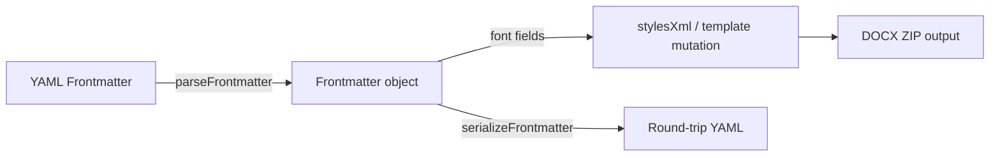

# Design Document: DOCX Font Customization

## Overview

This feature adds four YAML frontmatter fields (`font`, `code-font`, `font-size`, `code-font-size`) that let authors control typography in DOCX exports. The implementation touches three layers: frontmatter parsing/serialization (`src/frontmatter.ts`), DOCX style generation (`src/md-to-docx.ts`), and specification documentation (`docs/specification.md`).

The key design challenge is applying font overrides consistently across all OOXML styles — including proportional heading scaling — and ensuring overrides take precedence over template DOCX styles when both are present.

## Architecture

The feature follows the existing data flow with minimal new abstractions:



Font override resolution happens in `convertMdToDocx()` after frontmatter parsing and before style XML generation. The resolution logic computes effective font/size values (including code-font-size inference) and passes them to a new `stylesXml(overrides)` signature or a template style mutation function.

No new files are needed. All changes are contained within `src/frontmatter.ts` and `src/md-to-docx.ts`, plus documentation updates to `docs/specification.md`.

## Components and Interfaces

### 1. Frontmatter Interface Extension (`src/frontmatter.ts`)

Add four optional fields to the existing `Frontmatter` interface:

```typescript
export interface Frontmatter {
  // ... existing fields ...
  font?: string;
  codeFont?: string;
  fontSize?: number;
  codeFontSize?: number;
}
```

`parseFrontmatter()` gains four new `case` branches in its switch statement:
- `font` → `metadata.font = value` (string, any non-empty value)
- `code-font` → `metadata.codeFont = value` (string, any non-empty value)
- `font-size` → `metadata.fontSize = parseFloat(value)` (only if result is a finite positive number)
- `code-font-size` → `metadata.codeFontSize = parseFloat(value)` (only if result is a finite positive number)

`serializeFrontmatter()` emits the four fields when present, using hyphenated YAML keys (`font`, `code-font`, `font-size`, `code-font-size`).

### 2. Font Override Resolution (`src/md-to-docx.ts`)

A new pure function computes effective font settings from the parsed frontmatter:

```typescript
interface FontOverrides {
  bodyFont?: string;       // w:rFonts ascii/hAnsi for non-code styles
  codeFont?: string;       // w:rFonts ascii/hAnsi for code styles
  bodySizeHp?: number;     // half-points for Normal style
  codeSizeHp?: number;     // half-points for code styles
  headingSizesHp?: Map<string, number>; // styleId → half-points
}

function resolveFontOverrides(fm: Frontmatter): FontOverrides | undefined
```

Constants for default sizes (all in half-points):

| Style | Default (hp) | Ratio to Normal |
|-------|-------------|-----------------|
| Normal | 22 | 1.0 |
| Heading1 | 32 | 32/22 ≈ 1.4545 |
| Heading2 | 26 | 26/22 ≈ 1.1818 |
| Heading3 | 24 | 24/22 ≈ 1.0909 |
| Heading4 | 22 | 22/22 = 1.0 |
| Heading5 | 20 | 20/22 ≈ 0.9091 |
| Heading6 | 18 | 18/22 ≈ 0.8182 |
| Title | 56 | 56/22 ≈ 2.5455 |
| FootnoteText | 20 | 20/22 ≈ 0.9091 |
| EndnoteText | 20 | 20/22 ≈ 0.9091 |
| CodeBlock | 20 | (uses code size) |

Heading scaling formula: `Math.round(ratio * newBodySizeHp)` where ratio = `defaultHeadingHp / DEFAULT_BODY_HP`.

Code-font-size inference: when `fontSize` is set but `codeFontSize` is not, `codeSizeHp = bodySizeHp - 2` (2 half-points = 1pt, the Default_Size_Difference).

### 3. Style XML Generation (`src/md-to-docx.ts`)

The existing `stylesXml()` function gains an optional `FontOverrides` parameter:

```typescript
function stylesXml(overrides?: FontOverrides): string
```

When overrides are provided:
- Non-code styles get `<w:rFonts w:ascii="X" w:hAnsi="X"/>` if `bodyFont` is set
- Normal gets `<w:sz w:val="N"/>` / `<w:szCs w:val="N"/>` if `bodySizeHp` is set
- Each heading gets its proportionally scaled size from `headingSizesHp`
- Title, FootnoteText, EndnoteText get proportionally scaled sizes
- CodeChar and CodeBlock get `codeFont` for `w:rFonts` if set
- CodeBlock gets `codeSizeHp` for `w:sz`/`w:szCs` if set

### 4. Template Style Mutation (`src/md-to-docx.ts`)

A new function applies font overrides to a template's `word/styles.xml`:

```typescript
function applyFontOverridesToTemplate(
  stylesXmlBytes: Uint8Array,
  overrides: FontOverrides
): string
```

This function:
1. Decodes the template `styles.xml` to a string
2. Parses style blocks using regex to find `<w:style>` elements by `w:styleId`
3. For each matching style, inserts/replaces `w:rFonts` and `w:sz`/`w:szCs` attributes in the `<w:rPr>` section
4. Returns the modified XML string

The style ID matching uses the same categorization: non-code styles (Normal, Heading1–6, Title, Quote, IntenseQuote, FootnoteText, EndnoteText) get body font/size overrides; code styles (CodeChar, CodeBlock) get code font/size overrides.

### 5. Integration in `convertMdToDocx()`

In the main conversion function, after frontmatter parsing:

```typescript
const fontOverrides = resolveFontOverrides(frontmatter);

// Later, when writing styles:
if (templateParts?.has('word/styles.xml') && fontOverrides) {
  const mutated = applyFontOverridesToTemplate(
    templateParts.get('word/styles.xml')!,
    fontOverrides
  );
  zip.file('word/styles.xml', mutated);
} else if (templateParts?.has('word/styles.xml')) {
  zip.file('word/styles.xml', templateParts.get('word/styles.xml')!);
} else {
  zip.file('word/styles.xml', stylesXml(fontOverrides));
}
```

## Data Models

### Frontmatter Fields

| YAML Key | Interface Field | Type | Default | Validation |
|----------|----------------|------|---------|------------|
| `font` | `font` | `string` | (none — app default) | Non-empty string |
| `code-font` | `codeFont` | `string` | `"Consolas"` | Non-empty string |
| `font-size` | `fontSize` | `number` | `11` (pt) | Finite positive number |
| `code-font-size` | `codeFontSize` | `number` | `10` (pt) | Finite positive number |

### Size Conversion

Points to half-points: `hp = pt * 2`

The OOXML `w:sz` and `w:szCs` attributes use half-points. All internal calculations use half-points to avoid floating-point issues. The frontmatter fields use points (the user-facing unit).

### Font Override Resolution Rules

1. If no font fields are set → return `undefined` (no overrides)
2. `bodyFont` = `fm.font` if present
3. `codeFont` = `fm.codeFont` if present
4. `bodySizeHp` = `fm.fontSize * 2` if `fontSize` is a valid positive number
5. If `fontSize` is set and `codeFontSize` is not → `codeSizeHp = bodySizeHp - 2`
6. If `codeFontSize` is set → `codeSizeHp = fm.codeFontSize * 2`
7. If `bodySizeHp` is set → compute `headingSizesHp` using proportional scaling


## Correctness Properties

*A property is a characteristic or behavior that should hold true across all valid executions of a system — essentially, a formal statement about what the system should do. Properties serve as the bridge between human-readable specifications and machine-verifiable correctness guarantees.*

### Property 1: Font string field parsing

*For any* non-empty string value, a YAML frontmatter block containing `font: <value>` or `code-font: <value>` should produce a Frontmatter object where the corresponding field (`font` or `codeFont`) equals that string value.

**Validates: Requirements 1.1, 1.2**

### Property 2: Numeric size field parsing

*For any* finite positive number, a YAML frontmatter block containing `font-size: <number>` or `code-font-size: <number>` should produce a Frontmatter object where the corresponding field (`fontSize` or `codeFontSize`) equals that number.

**Validates: Requirements 1.3, 1.4**

### Property 3: Non-numeric size rejection

*For any* string that is not a finite positive number (e.g., alphabetic strings, empty strings, NaN, Infinity, negative numbers, zero), a YAML frontmatter block containing `font-size: <value>` or `code-font-size: <value>` should produce a Frontmatter object where the corresponding size field is `undefined`.

**Validates: Requirements 1.5, 1.6**

### Property 4: Code-font-size inference

*For any* valid positive font-size value `S`, when `resolveFontOverrides` is called with `fontSize = S` and no `codeFontSize`, the resolved `codeSizeHp` should equal `(S - 1) * 2` (i.e., body size minus 1pt, converted to half-points). When both `fontSize` and `codeFontSize` are explicitly provided, the resolved `codeSizeHp` should equal `codeFontSize * 2` regardless of `fontSize`. When only `codeFontSize` is provided, `bodySizeHp` should be undefined and `codeSizeHp` should equal `codeFontSize * 2`.

**Validates: Requirements 2.1, 2.2, 2.3**

### Property 5: Body font application to non-code styles

*For any* non-empty font name string, the styles XML generated with that body font override should contain `w:rFonts` elements with `w:ascii` and `w:hAnsi` attributes set to that font name in every non-code style (Normal, Heading1–6, Title, Quote, IntenseQuote, FootnoteText, EndnoteText), and should NOT set that font in code styles (CodeChar, CodeBlock).

**Validates: Requirements 3.1**

### Property 6: Code font application to code styles

*For any* non-empty font name string, the styles XML generated with that code font override should contain `w:rFonts` elements with `w:ascii` and `w:hAnsi` attributes set to that font name in CodeChar and CodeBlock styles, and should NOT affect the `w:rFonts` in non-code styles.

**Validates: Requirements 3.2**

### Property 7: Size and heading proportional scaling

*For any* valid positive body font size `S` (in points), the generated styles XML should set Normal's `w:sz` to `S * 2` (half-points), and each heading style's `w:sz` should equal `Math.round(defaultHeadingHp / 22 * S * 2)`, preserving the ratio between each heading and the default 11pt body size. CodeBlock's `w:sz` should reflect the resolved code size (explicit or inferred).

**Validates: Requirements 3.3, 3.4, 3.5**

### Property 8: Template font override application

*For any* valid styles XML string from a template and any font override, applying `applyFontOverridesToTemplate` should produce XML where the overridden styles contain the specified font/size values, while styles not targeted by the override remain unchanged. When no overrides are provided, the template XML should pass through unmodified.

**Validates: Requirements 4.1, 4.2, 4.3, 4.4**

### Property 9: Frontmatter font field round-trip

*For any* valid Frontmatter object containing any combination of font fields (`font`, `codeFont`, `fontSize`, `codeFontSize`), serializing it with `serializeFrontmatter()` and then parsing the result with `parseFrontmatter()` should produce a Frontmatter object with equivalent font field values.

**Validates: Requirements 5.1, 5.2, 5.3**

## Error Handling

### Invalid Font Size Values

When `font-size` or `code-font-size` contains a non-numeric value (e.g., `"large"`, `"12px"`, empty string), the parser silently ignores the field. No warning is emitted — this matches the existing frontmatter parsing behavior where unrecognized or invalid values are simply skipped. The converter proceeds with default sizes.

### Zero or Negative Font Sizes

Values ≤ 0 are treated as invalid and ignored during parsing. The `parseFloat` result must be both `isFinite()` and `> 0` to be accepted.

### Code-Font-Size Inference Edge Case

When `font-size` is set to 1 or less than 1, the inferred `code-font-size` would be 0 or negative. Since font-size must be > 0 to be accepted, the minimum valid font-size is just above 0, making the inferred code-font-size potentially very small but still positive (e.g., font-size=0.5 → code-font-size=-0.5 which is invalid). The resolution function should clamp the inferred code size to a minimum of 1 half-point (0.5pt) to avoid generating invalid OOXML.

### Template Style Mutation

If a template's `word/styles.xml` does not contain a particular style ID (e.g., no `CodeBlock` style), the mutation function simply skips that style. No error is raised — the override only applies to styles that exist in the template.

### Font Name Validation

Font names are accepted as-is without validation against installed system fonts. OOXML allows any font name; the rendering application (Word, LibreOffice) handles missing font substitution. This is consistent with how Word itself works.

## Testing Strategy

### Property-Based Tests (fast-check)

Use `fast-check` as the property-based testing library, consistent with the existing test suite. Each property test runs a minimum of 100 iterations.

All property tests go in a new file: `src/font-customization.property.test.ts`

Each test is tagged with a comment referencing the design property:
```
// Feature: docx-font-customization, Property N: <property title>
```

Properties to implement as property-based tests:
- **Property 1**: Generate random non-empty strings, build frontmatter YAML, parse, verify font/codeFont fields
- **Property 2**: Generate random positive numbers, build frontmatter YAML, parse, verify fontSize/codeFontSize fields
- **Property 3**: Generate non-numeric strings, build frontmatter YAML, parse, verify size fields are undefined
- **Property 4**: Generate random positive font sizes, call resolveFontOverrides with various combinations, verify inference rules
- **Property 5**: Generate random font names, call stylesXml with body font override, parse output XML to verify w:rFonts placement
- **Property 6**: Generate random font names, call stylesXml with code font override, parse output XML to verify w:rFonts placement
- **Property 7**: Generate random positive body sizes, call stylesXml, parse output XML to verify proportional heading sizes
- **Property 8**: Generate font overrides, apply to a template styles XML, verify targeted styles are modified and others unchanged
- **Property 9**: Generate random Frontmatter objects with font fields, serialize then parse, verify equivalence

Generators should use short bounded strings (maxLength: 20) and reasonable numeric ranges (0.5–72 for font sizes) to avoid timeouts, per AGENTS.md guidance.

### Unit Tests

Unit tests go in `src/font-customization.test.ts` and cover:
- Default behavior: no font fields → styles identical to current output
- Template passthrough: template with no overrides → unmodified
- Specific example: `font-size: 14` → Normal=28hp, H1=Math.round(32/22*28)=41hp, CodeBlock=26hp (inferred 13pt)
- Edge case: `font-size: 1` → code-font-size clamped to minimum
- Edge case: `font-size: abc` → ignored
- Edge case: `font-size: -5` → ignored
- Edge case: `font-size: 0` → ignored
- Integration: full `convertMdToDocx` with font frontmatter → verify styles in output DOCX ZIP

### Test Configuration

- Property tests: `{ numRuns: 100 }` per fast-check convention
- Timeout: 30 seconds per property test (consistent with existing property tests)
- Test runner: `bun test`
