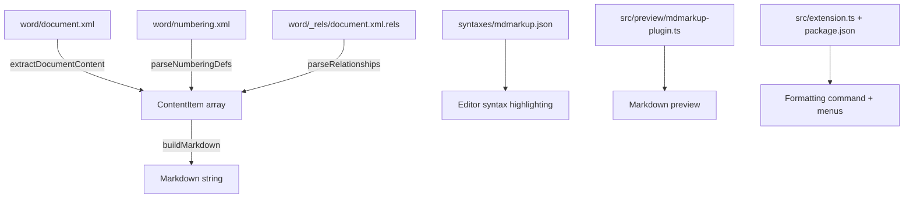

# Design Document: DOCX Formatting Conversion

## Overview

This feature extends the existing `converter.ts` DOCX-to-Markdown converter and the mdmarkup editor/preview infrastructure to handle rich formatting. The converter changes are purely additive: the `ContentItem` union gains formatting metadata fields, `extractDocumentContent()` reads OOXML run/paragraph properties, and `buildMarkdown()` emits the appropriate Markdown delimiters. Separately, the editor gains a `==highlight==` formatting command, TextMate grammar pattern, and markdown-it preview rule — all distinct from the existing CriticMarkup `{==highlight==}` support.

## Architecture

The changes touch four layers:



The converter pipeline remains: unzip → parse XML → extract content → build markdown. We add two new XML parsing steps (numbering definitions and relationships) and enrich the content items with formatting metadata.

## Components and Interfaces

### Extended ContentItem Types

```typescript
/** Character-level formatting flags */
interface RunFormatting {
  bold: boolean;
  italic: boolean;
  underline: boolean;
  strikethrough: boolean;
  highlight: boolean;
  superscript: boolean;
  subscript: boolean;
}

/** List metadata for a paragraph */
interface ListMeta {
  type: 'bullet' | 'ordered';
  level: number; // 0-based indentation level
}

type ContentItem =
  | {
      type: 'text';
      text: string;
      commentIds: Set<string>;
      formatting: RunFormatting;
      href?: string;           // hyperlink URL if inside w:hyperlink
    }
  | { type: 'citation'; text: string; commentIds: Set<string>; pandocKeys: string[] }
  | {
      type: 'para';
      headingLevel?: number;   // 1–6 if heading, undefined otherwise
      listMeta?: ListMeta;     // present if list item
    };
```

A default `RunFormatting` object has all fields `false`. The existing `citation` variant is unchanged.

### New Helper Functions

```typescript
/** Parse word/_rels/document.xml.rels into a Map<rId, targetUrl> */
function parseRelationships(zip: JSZip): Promise<Map<string, string>>;

/** Parse word/numbering.xml into a Map<numId, Map<ilvl, 'bullet'|'ordered'>> */
function parseNumberingDefinitions(zip: JSZip): Promise<Map<string, Map<string, 'bullet' | 'ordered'>>>;

/** Extract RunFormatting from a w:rPr node */
function parseRunProperties(rPrChildren: any[]): RunFormatting;

/** Extract heading level from w:pPr > w:pStyle (returns undefined if not a heading) */
function parseHeadingLevel(pPrChildren: any[]): number | undefined;

/** Extract list metadata from w:pPr > w:numPr using numbering definitions */
function parseListMeta(
  pPrChildren: any[],
  numberingDefs: Map<string, Map<string, 'bullet' | 'ordered'>>
): ListMeta | undefined;
```

### Formatting Delimiter Application

`buildMarkdown()` wraps text content with delimiters based on `RunFormatting`. The nesting order (outermost to innermost) is:

1. Bold: `**…**`
2. Italic: `*…*`
3. Strikethrough: `~~…~~`
4. Underline: `<u>…</u>`
5. Highlight: `==…==`
6. Superscript: `<sup>…</sup>` / Subscript: `<sub>…</sub>`

A helper function `wrapWithFormatting(text: string, fmt: RunFormatting): string` applies delimiters in this order. Consecutive text items with identical formatting and href are merged before wrapping.

### Hyperlink Handling

When `extractDocumentContent()` encounters a `w:hyperlink` node, it reads the `r:id` attribute, looks it up in the relationship map, and sets `href` on all child text items. In `buildMarkdown()`, text items with `href` are emitted as `[formattedText](url)` — formatting delimiters go inside the link text.

### Heading and List Handling

`buildMarkdown()` inspects each `para` item:
- If `headingLevel` is set, prefix the paragraph's text with `#` × level + space.
- If `listMeta` is set, prefix with the appropriate marker (`- ` or `1. `) indented by level. Consecutive list items suppress the blank line that `para` normally emits.

### Editor Highlight Support

Three additions for `==text==` formatting highlight (not CriticMarkup):

1. **Command**: `mdmarkup.formatHighlight` — calls `wrapSelection(text, '==', '==')`, registered in `extension.ts`.
2. **Menu**: Added to `markdown.formatting` submenu in `package.json` at `1_format@6` (after underline, before inline code which shifts to `@7`).
3. **TextMate grammar**: New `format_highlight` pattern in `syntaxes/mdmarkup.json` matching `==…==` but NOT `{==…==}`. Uses a negative lookbehind for `{` and negative lookahead for `}`.
4. **Preview**: New inline rule in `mdmarkup-plugin.ts` that detects `==…==` (when not preceded by `{`) and renders as `<mark class="mdmarkup-format-highlight">`. New CSS class with a yellow/amber background distinct from the purple CriticMarkup highlight.


## Data Models

### RunFormatting

| Field | Type | Default | OOXML Source |
|-------|------|---------|-------------|
| bold | boolean | false | `w:rPr > w:b` (absent or `w:val` not `"false"`/`"0"`) |
| italic | boolean | false | `w:rPr > w:i` (same logic) |
| underline | boolean | false | `w:rPr > w:u` with `w:val` ≠ `"none"` |
| strikethrough | boolean | false | `w:rPr > w:strike` (same logic as bold) |
| highlight | boolean | false | `w:rPr > w:highlight` with `w:val` ≠ `"none"`, OR `w:rPr > w:shd` with `w:fill` ≠ `""` and ≠ `"auto"` |
| superscript | boolean | false | `w:rPr > w:vertAlign` with `w:val="superscript"` |
| subscript | boolean | false | `w:rPr > w:vertAlign` with `w:val="subscript"` |

### Boolean Toggle Detection

OOXML uses a toggle pattern for boolean properties like `w:b`, `w:i`, `w:strike`:
- Element present with no `w:val` attribute → `true`
- Element present with `w:val="true"` or `w:val="1"` → `true`
- Element present with `w:val="false"` or `w:val="0"` → `false`
- Element absent → `false`

Helper: `function isToggleOn(children: any[], tagName: string): boolean`

### Numbering Definitions Map

Parsed from `word/numbering.xml`:

```
Map<numId, Map<ilvl, 'bullet' | 'ordered'>>
```

The XML structure is:
```xml
<w:abstractNum w:abstractNumId="0">
  <w:lvl w:ilvl="0">
    <w:numFmt w:val="bullet"/>
  </w:lvl>
</w:abstractNum>
<w:num w:numId="1">
  <w:abstractNumId w:val="0"/>
</w:num>
```

We first build `abstractNumId → levels`, then resolve `numId → abstractNumId` to produce the final map.

### Relationship Map

Parsed from `word/_rels/document.xml.rels`:

```
Map<rId, targetUrl>
```

Only relationships with `Type` ending in `/hyperlink` and `TargetMode="External"` are included.

### Run Merging Strategy

Before applying formatting delimiters, `buildMarkdown()` merges consecutive text items that share:
- Identical `RunFormatting` (all 7 fields match)
- Identical `href` (both undefined, or same URL)
- Identical `commentIds` (same set)

This prevents fragmented output like `**bold**` `**more bold**` → `**bold more bold**`.


## Correctness Properties

*A property is a characteristic or behavior that should hold true across all valid executions of a system — essentially, a formal statement about what the system should do. Properties serve as the bridge between human-readable specifications and machine-verifiable correctness guarantees.*

### Property 1: Formatting wrapping produces correct delimiters

*For any* non-empty text string and *for any* `RunFormatting` with exactly one flag set to `true`, `wrapWithFormatting(text, fmt)` shall produce output that starts with the correct opening delimiter and ends with the correct closing delimiter for that format type (bold→`**`, italic→`*`, strikethrough→`~~`, underline→`<u>`, highlight→`==`, superscript→`<sup>`, subscript→`<sub>`), with the original text contained within.

**Validates: Requirements 1.1, 2.1, 3.1, 4.1, 5.1, 6.1, 7.1**

### Property 2: Consecutive runs with identical formatting merge into a single span

*For any* sequence of two or more text `ContentItem`s that share identical `RunFormatting`, identical `href`, and identical `commentIds`, `buildMarkdown` shall produce output containing exactly one opening and one closing delimiter pair for each active format — not multiple adjacent pairs.

**Validates: Requirements 1.2, 2.2, 4.2, 5.3, 6.2, 7.2**

### Property 3: Combined formatting nesting order is consistent

*For any* non-empty text string and *for any* `RunFormatting` with two or more flags set to `true`, `wrapWithFormatting(text, fmt)` shall nest delimiters so that bold is outermost, then italic, then strikethrough, then underline, then highlight, then superscript/subscript innermost. All opened delimiters shall be properly closed.

**Validates: Requirements 8.1, 8.2**

### Property 4: Hyperlink text items produce Markdown link syntax

*For any* non-empty text string and *for any* non-empty URL string, a text `ContentItem` with `href` set shall cause `buildMarkdown` to produce output matching the pattern `[…](url)` where the URL appears verbatim inside the parentheses.

**Validates: Requirements 9.1, 9.2**

### Property 5: Formatting delimiters appear inside hyperlink text

*For any* non-empty text string, *for any* non-empty URL, and *for any* `RunFormatting` with at least one flag set, `buildMarkdown` shall produce output where the formatting delimiters are contained within the `[…]` portion of the Markdown link, not outside it.

**Validates: Requirements 9.4**

### Property 6: Heading paragraphs produce correct # prefix

*For any* heading level in 1–6 and *for any* non-empty paragraph text (possibly with formatting), `buildMarkdown` shall produce output where the paragraph line starts with exactly `level` `#` characters followed by a space, followed by the (possibly formatted) text.

**Validates: Requirements 10.1, 10.2**

### Property 7: List items produce correct prefix and indentation

*For any* list type (`bullet` or `ordered`) and *for any* indentation level 0–5 and *for any* non-empty text, `buildMarkdown` shall produce output where the line starts with `(2 * level)` spaces + `"- "` for bullet lists, or `(3 * level)` spaces + `"1. "` for ordered lists.

**Validates: Requirements 11.1, 11.2, 12.1, 12.2**

### Property 8: Consecutive list items have no blank lines between them

*For any* sequence of two or more consecutive `para` items with `listMeta` set (same or different list types), `buildMarkdown` shall produce output where no blank line appears between adjacent list items.

**Validates: Requirements 11.3, 12.3**

### Property 9: Highlight formatting command wraps with == delimiters

*For any* non-empty text string, `wrapSelection(text, '==', '==')` shall produce output that equals `==` + text + `==`.

**Validates: Requirements 14.1**

### Property 10: Preview ==highlight== rendering

*For any* non-empty text string that does not contain `==`, rendering `==text==` through the markdown-it plugin shall produce HTML output containing a `<mark>` element with the `mdmarkup-format-highlight` CSS class and the original text as content.

**Validates: Requirements 16.1**

## Error Handling

| Scenario | Behavior |
|----------|----------|
| `w:rPr` absent from a run | All formatting flags default to `false` |
| `word/numbering.xml` missing from zip | Numbering definitions map is empty; all `w:numPr` references produce no list metadata |
| `word/_rels/document.xml.rels` missing | Relationship map is empty; all hyperlinks fall back to plain text (Req 9.3) |
| `w:hyperlink` with unresolvable `r:id` | Output link text as plain text, no `[](url)` syntax |
| `w:pStyle` with unrecognized value | Treated as normal paragraph (Req 10.3) |
| `w:numPr` referencing undefined `numId` | Treated as normal paragraph (no list prefix) |
| `w:vertAlign` with value other than `"superscript"` or `"subscript"` | Ignored (no sup/sub wrapping) |
| `w:highlight` with `w:val="none"` | Treated as non-highlighted |
| `w:u` with `w:val="none"` | Treated as non-underlined |
| Empty text runs | Skipped — no formatting delimiters emitted for empty strings |

## Testing Strategy

### Unit Tests

Unit tests validate specific examples and edge cases using `bun:test`:

- **Fixture test**: Convert `test/fixtures/formatting_sample.docx` and compare output against an expected markdown string (Req 13.1–13.4)
- **Toggle detection edge cases**: `isToggleOn` with `w:val="false"`, `w:val="0"`, absent element (Req 1.3, 2.3, 4.3)
- **Highlight via `w:shd`**: Verify `w:shd` with non-auto fill triggers highlight (Req 5.2)
- **Unresolvable hyperlink**: Verify plain text fallback when `r:id` is missing (Req 9.3)
- **Non-heading pStyle**: Verify no `#` prefix for unknown styles (Req 10.3)
- **TextMate grammar**: Verify the regex does not match `{==text==}` (Req 15.3)

### Property-Based Tests

Property tests use `fast-check` with minimum 100 iterations per property. Per AGENTS.md guidance, use bounded generators (short strings) to avoid timeouts.

Each property test is tagged with a comment:
- **Feature: docx-formatting-conversion, Property 1: Formatting wrapping produces correct delimiters**
- **Feature: docx-formatting-conversion, Property 2: Consecutive runs with identical formatting merge**
- **Feature: docx-formatting-conversion, Property 3: Combined formatting nesting order**
- **Feature: docx-formatting-conversion, Property 4: Hyperlink text items produce Markdown link syntax**
- **Feature: docx-formatting-conversion, Property 5: Formatting delimiters inside hyperlink text**
- **Feature: docx-formatting-conversion, Property 6: Heading paragraphs produce correct # prefix**
- **Feature: docx-formatting-conversion, Property 7: List items produce correct prefix and indentation**
- **Feature: docx-formatting-conversion, Property 8: Consecutive list items have no blank lines**
- **Feature: docx-formatting-conversion, Property 9: Highlight formatting command wraps with == delimiters**
- **Feature: docx-formatting-conversion, Property 10: Preview ==highlight== rendering**

### Test Configuration

- Library: `fast-check` (already a devDependency)
- Runner: `bun test`
- Minimum iterations: 100 per property (use `{ numRuns: 100 }`)
- String generators: Use `fc.string({ minLength: 1, maxLength: 50 })` to keep tests fast
- Each property test must be a single `fc.assert(fc.property(...))` call
- Each correctness property maps to exactly one property-based test
