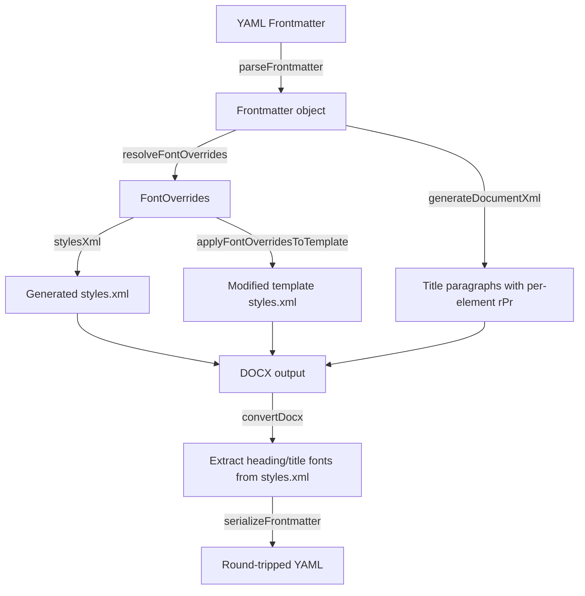

# Design Document: Header Font Configuration

## Overview

This feature extends the YAML frontmatter system to support per-heading-level and per-title-paragraph font configuration. Six new fields are added to the `Frontmatter` interface: `headerFont`, `headerFontSize`, `headerFontStyle` for heading levels 1–6, and `titleFont`, `titleFontSize`, `titleFontStyle` for title paragraphs. Each field accepts a single value or an Inline_Array (bracketed or bare comma-separated). The `title` field also gains Inline_Array support alongside its existing repeated-key format.

Changes span five modules:
- `src/frontmatter.ts` — parsing, serialization, and the `Frontmatter` interface
- `src/md-to-docx.ts` — `FontOverrides` interface, `resolveFontOverrides()`, `stylesXml()`, `applyFontOverridesToTemplate()`, and `generateDocumentXml()`
- `src/converter.ts` — `convertDocx()` extraction of heading/title font properties from `word/styles.xml`
- `src/lsp/server.ts` — LSP completions for new frontmatter keys
- `docs/specification.md` — user-facing documentation of the new fields

## Architecture



The data flows through three layers:

1. **Parse layer** (`parseFrontmatter`): Raw YAML string → `Frontmatter` object with typed arrays
2. **Resolve layer** (`resolveFontOverrides`): `Frontmatter` → `FontOverrides` with per-heading-level and per-title-element resolved values, applying Array_Inheritance and fallback to `font`
3. **Emit layer** (`stylesXml` / `applyFontOverridesToTemplate` / `generateDocumentXml`): `FontOverrides` → OOXML elements in heading styles and title paragraph run properties

## Components and Interfaces

### 1. Inline Array Parsing (`src/frontmatter.ts`)

A shared utility function `parseInlineArray(value: string): string[]` handles both syntaxes:

```typescript
function parseInlineArray(value: string): string[] {
  let inner = value;
  if (inner.startsWith('[') && inner.endsWith(']')) {
    inner = inner.slice(1, -1);
  }
  if (!inner.includes(',')) return [inner.trim()];
  return inner.split(',').map(s => s.trim()).filter(s => s.length > 0);
}
```

Detection logic: if the value starts with `[` and ends with `]`, strip brackets. Otherwise, if the value contains commas, split on commas. Both paths produce the same result.

### 2. Font Style Normalization (`src/frontmatter.ts`)

A function `normalizeFontStyle(raw: string): string | undefined` validates and normalizes Font_Style values:

```typescript
// Design rationale: A single combined header-font-style field was chosen over
// separate CSS-style fields (font-style, font-weight, font-decoration) because:
// 1. One field is simpler for authors than three separate fields.
// 2. Manuscript authors are not web developers — CSS distinctions between
//    font-style, font-weight, and text-decoration are unfamiliar.
// 3. Word only supports bold on/off (no numeric weights 100–900), so a
//    separate font-weight field accepting numbers would be misleading.
const VALID_STYLE_PARTS = new Set(['bold', 'italic', 'underline']);
const CANONICAL_ORDER = ['bold', 'italic', 'underline'];

function normalizeFontStyle(raw: string): string | undefined {
  const lower = raw.toLowerCase().trim();
  if (lower === 'normal') return 'normal';
  const parts = lower.split('-');
  const unique = [...new Set(parts)];
  if (unique.length !== parts.length) return undefined; // duplicates
  if (!unique.every(p => VALID_STYLE_PARTS.has(p))) return undefined;
  return unique.sort((a, b) => CANONICAL_ORDER.indexOf(a) - CANONICAL_ORDER.indexOf(b)).join('-');
}
```

Canonical ordering is `bold-italic-underline`, so `italic-bold` normalizes to `bold-italic` and `underline-bold-italic` normalizes to `bold-italic-underline`.

### 3. Frontmatter Interface Changes (`src/frontmatter.ts`)

```typescript
export interface Frontmatter {
  title?: string[];
  author?: string;
  csl?: string;
  locale?: string;
  zoteroNotes?: NoteType;
  notes?: NotesMode;
  timezone?: string;
  bibliography?: string;
  font?: string;
  codeFont?: string;
  fontSize?: number;
  codeFontSize?: number;
  // New fields:
  headerFont?: string[];
  headerFontSize?: number[];
  headerFontStyle?: string[];
  titleFont?: string[];
  titleFontSize?: number[];
  titleFontStyle?: string[];
}
```

### 4. parseFrontmatter Changes (`src/frontmatter.ts`)

New `case` branches in the parsing switch:

- `header-font`: `parseInlineArray(value)` → `metadata.headerFont`
- `header-font-size`: `parseInlineArray(value)`, parse each as number, filter positive finite → `metadata.headerFontSize`
- `header-font-style`: `parseInlineArray(value)`, normalize each via `normalizeFontStyle()`, filter undefined → `metadata.headerFontStyle`
- `title-font`, `title-font-size`, `title-font-style`: same logic as header counterparts → `metadata.titleFont`, `metadata.titleFontSize`, `metadata.titleFontStyle`
- `title`: extended to detect Inline_Array syntax. If the value starts with `[` and ends with `]`, parse as inline array and store. If repeated keys are present alongside an inline array line, the repeated-key values take precedence (the inline array line is treated as a plain repeated-key entry whose value happens to start with `[`; since repeated keys already accumulate, the inline array is effectively ignored when mixed with repeated keys). For a single `title:` line with brackets and no other `title:` lines, parse as inline array.

For repeated YAML keys (`header-font`, `header-font-size`, `header-font-style`, `title-font`, `title-font-size`, `title-font-style`), only the last occurrence is used. This is the natural YAML behavior — each `case` assignment overwrites the previous value.

### 5. serializeFrontmatter Changes (`src/frontmatter.ts`)

After existing fields, emit new fields:

```typescript
// header-font
if (metadata.headerFont && metadata.headerFont.length === 1) {
  lines.push('header-font: ' + metadata.headerFont[0]);
} else if (metadata.headerFont && metadata.headerFont.length > 1) {
  lines.push('header-font: [' + metadata.headerFont.join(', ') + ']');
}
// Same pattern for headerFontSize, headerFontStyle, titleFont, titleFontSize, titleFontStyle
```

Single values emit plain `key: value`. Multiple values emit `key: [v1, v2, ...]`. Undefined or empty arrays are omitted.

Title serialization preserves the existing repeated-key format: one `title:` line per array element.

### 6. FontOverrides Interface Changes (`src/md-to-docx.ts`)

```typescript
export interface FontOverrides {
  bodyFont?: string;
  codeFont?: string;
  bodySizeHp?: number;
  codeSizeHp?: number;
  headingSizesHp?: Map<string, number>;
  // New fields:
  headingFonts?: Map<string, string>;        // styleId → font name
  headingStyles?: Map<string, string>;        // styleId → normalized font-style
  titleFonts?: string[];                      // per-title-element font names
  titleSizesHp?: number[];                    // per-title-element sizes in half-points
  titleStyles?: string[];                     // per-title-element normalized font-styles
}
```

### 7. resolveFontOverrides Changes (`src/md-to-docx.ts`)

The function is extended to populate the new `FontOverrides` fields:

```typescript
// Array inheritance helper: resolve value at index i from an array
function resolveAtIndex<T>(arr: T[] | undefined, index: number): T | undefined {
  if (!arr || arr.length === 0) return undefined;
  return index < arr.length ? arr[index] : arr[arr.length - 1];
}
```

**Heading font resolution:**
- For each heading level 1–6 (styleIds `Heading1`–`Heading6`):
  - Font: `resolveAtIndex(fm.headerFont, level-1)` ?? `fm.font` ?? undefined
  - Size: `resolveAtIndex(fm.headerFontSize, level-1)` — if defined, use explicit value (in half-points: value × 2); if undefined, fall through to existing proportional scaling from `fontSize`
  - Style: `resolveAtIndex(fm.headerFontStyle, level-1)` ?? undefined (default bold preserved in `stylesXml`)

When `headerFont` is defined, `headingFonts` map is populated. When `headerFont` is undefined but `font` is defined, the existing `bodyFont` field already handles heading font inheritance (headings inherit from Normal in the style hierarchy).

When `headerFontSize` is defined for a level, it takes precedence over proportional scaling from `fontSize`. The `headingSizesHp` map entry for that level is overwritten with the explicit value.

**Title font resolution:**
- For title elements, arrays are stored directly in `FontOverrides` after Array_Inheritance expansion is deferred to the emit layer (since the number of title paragraphs is only known at document generation time).
- `titleFonts`: `fm.titleFont` array, or `[fm.font]` if `titleFont` is undefined and `font` is defined
- `titleSizesHp`: `fm.titleFontSize` mapped to half-points (value × 2)
- `titleStyles`: `fm.titleFontStyle` array

### 8. stylesXml Changes (`src/md-to-docx.ts`)

The `headingRpr` helper is extended to accept per-heading font and style overrides:

```typescript
function headingRpr(styleId: string, defaultHp: number): string {
  // Font: per-heading override > body font > empty
  const font = overrides?.headingFonts?.get(styleId)
    ? rFonts(overrides.headingFonts.get(styleId)!)
    : bodyFontStr;
  
  // Size: headingSizesHp (already includes explicit header-font-size overrides) > default
  const sz = overrides?.headingSizesHp?.has(styleId)
    ? szPair(overrides.headingSizesHp.get(styleId)!)
    : szPair(defaultHp);
  
  // Style: per-heading override > default bold
  const style = overrides?.headingStyles?.get(styleId);
  let styleStr: string;
  if (style === 'normal') {
    styleStr = '';  // no bold, italic, or underline
  } else if (style) {
    styleStr = '';
    if (style.includes('bold')) styleStr += '<w:b/>';
    if (style.includes('italic')) styleStr += '<w:i/>';
    if (style.includes('underline')) styleStr += '<w:u w:val="single"/>';
  } else {
    styleStr = '<w:b/>';  // default: bold
  }
  
  return '<w:rPr>' + styleStr + font + sz + '</w:rPr>\n';
}
```

The Title style in `stylesXml` is similarly updated to use `overrides.titleFonts?.[0]`, `overrides.titleSizesHp?.[0]`, and `overrides.titleStyles?.[0]` for the first title element (since Word has a single Title style definition).

### 9. generateDocumentXml Changes (`src/md-to-docx.ts`)

Title paragraphs currently use the Title style with no inline run properties. To support per-title-element font overrides beyond the first element (which is handled by the Title style), title paragraphs at index > 0 need inline `<w:rPr>` elements:

```typescript
if (frontmatter?.title) {
  const overrides = state.fontOverrides; // passed through DocxGenState
  for (let i = 0; i < frontmatter.title.length; i++) {
    const line = frontmatter.title[i];
    let rPr = '';
    if (overrides) {
      const font = resolveAtIndex(overrides.titleFonts, i);
      const sizeHp = resolveAtIndex(overrides.titleSizesHp, i);
      const style = resolveAtIndex(overrides.titleStyles, i);
      // Build rPr for this title paragraph's run
      let rPrInner = '';
      if (style === 'normal') { /* no style elements */ }
      else if (style) {
        if (style.includes('bold')) rPrInner += '<w:b/>';
        if (style.includes('italic')) rPrInner += '<w:i/>';
        if (style.includes('underline')) rPrInner += '<w:u w:val="single"/>';
      }
      if (font) rPrInner += rFontsEl(font);
      if (sizeHp) rPrInner += szPairEl(sizeHp);
      if (rPrInner) rPr = '<w:rPr>' + rPrInner + '</w:rPr>';
    }
    body += '<w:p><w:pPr><w:pStyle w:val="Title"/></w:pPr>' + generateRun(line, rPr) + '</w:p>';
  }
}
```

### 10. applyFontOverridesToTemplate Changes (`src/md-to-docx.ts`)

The template override function is extended to handle per-heading font, size, and style overrides in heading styles (`Heading1`–`Heading6`) and the Title style:

- For each heading style: replace `w:rFonts` with heading-specific font (if defined), replace `w:sz`/`w:szCs` with heading-specific size, and replace/add/remove `w:b`, `w:i`, `w:u` based on heading-specific style.
- For the Title style: apply first title element's font, size, and style overrides.
- When a heading level has no override for a specific property, preserve the template's existing value.

### 11. converter.ts Changes (docx→md extraction)

The `convertDocx` function is extended to extract heading and title font properties from `word/styles.xml`:

```typescript
// After extracting title lines and building the frontmatter object:
const stylesXmlData = await readZipXml(zip, 'word/styles.xml');
if (stylesXmlData) {
  // Extract heading font properties from Heading1–Heading6 styles
  // Extract title font properties from Title style
  // Compare against defaults to determine which overrides were set
  // Populate fm.headerFont, fm.headerFontSize, fm.headerFontStyle,
  //          fm.titleFont, fm.titleFontSize, fm.titleFontStyle
}
```

The extraction parses each `<w:style>` element for `Heading1`–`Heading6` and `Title`, reading:
- `w:rFonts/@w:ascii` → font name
- `w:sz/@w:val` → size in half-points (÷ 2 for point size)
- `w:b` presence → bold
- `w:i` presence → italic  
- `w:u` presence → underline

Values matching the defaults (e.g., bold-only for headings, default sizes) are not emitted to keep frontmatter clean.

### 12. LSP Completions (`src/lsp/server.ts`)

The LSP completion handler is extended to offer completions for the new frontmatter keys when the cursor is on an empty line within the frontmatter block. This follows the same pattern as the existing `csl:` completion — detecting the frontmatter region and offering key completions:

New completion items: `header-font`, `header-font-size`, `header-font-style`, `title-font`, `title-font-size`, `title-font-style`.

Each completion item includes a description snippet showing example syntax.

## Data Models

### Frontmatter (extended)

| Field | Type | Source Key | Default |
|-------|------|-----------|---------|
| `headerFont` | `string[]` | `header-font` | undefined (falls back to `font`) |
| `headerFontSize` | `number[]` | `header-font-size` | undefined (falls back to proportional scaling) |
| `headerFontStyle` | `string[]` | `header-font-style` | undefined (default: bold) |
| `titleFont` | `string[]` | `title-font` | undefined (falls back to `font`) |
| `titleFontSize` | `number[]` | `title-font-size` | undefined |
| `titleFontStyle` | `string[]` | `title-font-style` | undefined |

### FontOverrides (extended)

| Field | Type | Description |
|-------|------|-------------|
| `headingFonts` | `Map<string, string>` | Per-heading-level font names (styleId → font) |
| `headingStyles` | `Map<string, string>` | Per-heading-level normalized font-style |
| `titleFonts` | `string[]` | Per-title-element font names |
| `titleSizesHp` | `number[]` | Per-title-element sizes in half-points |
| `titleStyles` | `string[]` | Per-title-element normalized font-styles |

### Font_Style Canonical Values

| Input | Normalized |
|-------|-----------|
| `bold` | `bold` |
| `italic` | `italic` |
| `underline` | `underline` |
| `normal` | `normal` |
| `bold-italic` | `bold-italic` |
| `italic-bold` | `bold-italic` |
| `bold-underline` | `bold-underline` |
| `underline-bold` | `bold-underline` |
| `italic-underline` | `italic-underline` |
| `underline-italic` | `italic-underline` |
| `bold-italic-underline` | `bold-italic-underline` |
| `italic-underline-bold` | `bold-italic-underline` |
| (any other) | undefined (ignored) |

### Array Inheritance Resolution

Given an array `A` of length `L` and a target index `i` (0-based):
- If `i < L`: use `A[i]`
- If `i >= L`: use `A[L-1]`
- If `L > 6` (headings) or `L > title count` (titles): ignore elements beyond the limit


## Design Rationale: Combined Font-Style Field (Requirement 11)

A single `header-font-style` (and `title-font-style`) field was chosen over separate CSS-style fields (`font-style`, `font-weight`, `font-decoration`) for three reasons:

1. **Simplicity for authors.** One field is easier to manage than three. Manuscript authors configure typography infrequently and benefit from a single, intuitive field.

2. **Target audience.** Many manuscript authors are not web developers. The CSS distinction between `font-style` (italic), `font-weight` (bold), and `text-decoration` (underline) is unfamiliar to the target audience. A combined field using plain English terms (`bold`, `italic`, `underline`, `normal`) is more accessible.

3. **Word's limited granularity.** Word does not support CSS-level font-weight customization (numeric weights 100–900). Word only provides bold on/off, italic on/off, and underline on/off. A separate `font-weight` field accepting numeric values would create a false expectation of granularity that the output format cannot honor.

The hyphenated combination syntax (`bold-italic`, `bold-underline`, `bold-italic-underline`) provides all necessary combinations while remaining readable and order-independent (normalization handles any input order).

## Correctness Properties

*A property is a characteristic or behavior that should hold true across all valid executions of a system — essentially, a formal statement about what the system should do. Properties serve as the bridge between human-readable specifications and machine-verifiable correctness guarantees.*

### Property 1: Inline array parsing equivalence

*For any* list of trimmed non-empty strings that do not contain commas or brackets, formatting them as a bracketed inline array `[v1, v2, v3]` and as bare comma-separated values `v1, v2, v3` and passing each to `parseInlineArray` should produce identical arrays, and both should equal the original list of strings.

**Validates: Requirements 1.1, 1.2, 1.3, 2.1, 2.2, 2.3, 3.1, 3.2, 3.3, 10.2, 13.1, 13.2, 13.3, 14.1, 14.2, 14.3, 15.1, 15.2, 15.3**

### Property 2: Font style normalization is canonical and idempotent

*For any* permutation of a subset of `{bold, italic, underline}`, `normalizeFontStyle` should produce the canonical ordering (`bold` before `italic` before `underline`), and normalizing the result a second time should produce the same value (idempotence). Additionally, `normalizeFontStyle('normal')` should return `'normal'`.

**Validates: Requirements 3.5, 3.6, 15.5, 15.6**

### Property 3: Invalid font styles are rejected

*For any* string that contains duplicate parts (e.g., `bold-bold`), unrecognized parts (e.g., `bold-heavy`), or is not composed of valid Font_Style parts, `normalizeFontStyle` should return `undefined`.

**Validates: Requirements 3.7, 15.7**

### Property 4: Invalid font sizes are filtered

*For any* array of strings where some elements are not positive finite numbers (e.g., negative, zero, NaN, Infinity, non-numeric), parsing a `header-font-size` or `title-font-size` field should include only the valid positive finite numbers in the result array, preserving their relative order.

**Validates: Requirements 2.5, 14.5**

### Property 5: Repeated keys use last occurrence

*For any* frontmatter YAML block containing multiple lines with the same key (for keys that use overwrite semantics: `header-font`, `header-font-size`, `header-font-style`, `title-font`, `title-font-size`, `title-font-style`), `parseFrontmatter` should store only the value from the last occurrence.

**Validates: Requirements 1.4, 2.4, 3.4, 13.4, 14.4, 15.4**

### Property 6: Array inheritance resolution

*For any* non-empty array of length L and any target index i ≥ 0, `resolveAtIndex(arr, i)` should return `arr[i]` when `i < L`, and `arr[L-1]` when `i >= L`. For heading fields, only the first 6 elements are used (indices 0–5).

**Validates: Requirements 4.1, 4.2, 4.3, 4.4, 13.8, 14.7, 15.9**

### Property 7: Serialization format correctness

*For any* Frontmatter object, `serializeFrontmatter` should: emit single-element arrays as plain `key: value` (no brackets), emit multi-element arrays as `key: [v1, v2, ...]` (bracketed), omit keys for undefined or empty arrays, and emit `title` using repeated-key format (one `title:` line per element).

**Validates: Requirements 5.1, 5.2, 5.3, 5.4, 5.5, 5.6, 5.7, 5.8, 5.9, 5.10, 5.11, 5.12, 5.13, 5.14, 5.15**

### Property 8: Parse–serialize–parse round-trip

*For any* valid Frontmatter object containing any combination of font fields (including the new header and title font fields), `parseFrontmatter(serializeFrontmatter(fm) + '\n\nBody.')` should produce a metadata object equivalent to the original (modulo the body text).

**Validates: Requirements 6.1**

### Property 9: Font fallback to body font

*For any* Frontmatter where `headerFont` is undefined and `font` is defined, `resolveFontOverrides` should produce a `FontOverrides` where all heading levels use the `font` value. The same applies to `titleFont` falling back to `font`.

**Validates: Requirements 1.6, 13.6**

### Property 10: header-font-size takes precedence over proportional scaling

*For any* Frontmatter where both `fontSize` and `headerFontSize` are defined, `resolveFontOverrides` should use the explicit `headerFontSize` value (× 2 for half-points) for heading levels where it is specified, ignoring the proportionally scaled value from `fontSize`.

**Validates: Requirements 7.10, 9.2, 9.3**

### Property 11: stylesXml heading and title output correctness

*For any* resolved `FontOverrides` with heading fonts, sizes, and styles, `stylesXml(overrides)` should produce XML where each heading style contains: the correct `w:rFonts` (if font specified), the correct `w:sz`/`w:szCs` (size in half-points), and the correct combination of `<w:b/>`, `<w:i/>`, `<w:u w:val="single"/>` matching the normalized font-style (with `normal` producing none of these elements).

**Validates: Requirements 7.1, 7.2, 7.3, 7.4, 7.5, 7.6, 7.7, 7.8, 7.9, 7.11, 7.12, 7.13, 7.14**

### Property 12: Template application preserves unmodified styles

*For any* template `styles.xml` and `FontOverrides` where some heading levels have overrides and others do not, `applyFontOverridesToTemplate` should modify only the styles with overrides and leave all other styles unchanged.

**Validates: Requirements 8.1, 8.2, 8.3, 8.4**

### Property 13: Backward compatibility of existing font fields

*For any* Frontmatter object containing only the pre-existing fields (`font`, `codeFont`, `fontSize`, `codeFontSize`) and none of the new header/title font fields, `resolveFontOverrides` should produce identical results to the original implementation (same `bodyFont`, `codeFont`, `bodySizeHp`, `codeSizeHp`, `headingSizesHp`).

**Validates: Requirements 9.1, 9.2**

### Property 14: Full pipeline round-trip (md→docx→md)

*For any* valid Frontmatter object containing header font and title font fields, converting a markdown document with that frontmatter to docx via `convertMdToDocx` and back via `convertDocx` should produce a Frontmatter object with equivalent header font and title font field values.

**Validates: Requirements 6.2**

## Error Handling

### Invalid Values

- **Non-numeric font sizes**: Elements that fail `parseFloat` or produce non-positive/non-finite values are silently dropped from the array. If all elements are invalid, the field is treated as undefined.
- **Invalid font styles**: Elements that contain unrecognized parts, duplicate parts, or are empty after trimming are silently dropped. If all elements are invalid, the field is treated as undefined.
- **Empty inline arrays**: `header-font: []` or `header-font: ` (empty value) results in the field being undefined.

### Edge Cases

- **Commas in font names**: Font names containing commas (e.g., `"Font, Inc"`) are not supported in bare comma-separated syntax. Authors must use a single-value field or avoid such font names. This is an acceptable limitation since virtually no real font names contain commas.
- **Brackets in values**: A value like `header-font: [Georgia` (unmatched bracket) is treated as a bare value starting with `[`, not as a malformed inline array. Only values that both start with `[` and end with `]` are treated as bracketed arrays.
- **More than 6 heading values**: Extra elements beyond index 5 are silently ignored by the Font_Resolver.
- **Title element count mismatch**: When `titleFont` has more elements than `title` paragraphs, extra elements are unused. When fewer, Array_Inheritance fills in.

### Graceful Degradation

- When new fields are absent, behavior is identical to the current implementation — no regressions.
- When a template file lacks a heading style (e.g., no `Heading5` defined), the override for that style is silently skipped.

## Testing Strategy

### Property-Based Testing

Use `fast-check` (already a project dependency) with `bun:test`. Each property test runs a minimum of 100 iterations.

**Test file**: `src/header-font-config.property.test.ts`

Properties to implement as property-based tests:

1. **Property 1** (Inline array parsing equivalence) — Generate arrays of 1–6 short alphanumeric strings, format as bracketed and bare, verify `parseInlineArray` produces identical results.
   - Tag: `Feature: header-font-config, Property 1: Inline array parsing equivalence`

2. **Property 2** (Font style normalization) — Generate random subsets of `{bold, italic, underline}`, permute, verify canonical output and idempotence.
   - Tag: `Feature: header-font-config, Property 2: Font style normalization is canonical and idempotent`

3. **Property 3** (Invalid font styles rejected) — Generate strings with duplicates, unknown parts, empty parts, verify `undefined` return.
   - Tag: `Feature: header-font-config, Property 3: Invalid font styles are rejected`

4. **Property 4** (Invalid font sizes filtered) — Generate mixed arrays of valid/invalid number strings, verify only valid positive finite numbers survive.
   - Tag: `Feature: header-font-config, Property 4: Invalid font sizes are filtered`

5. **Property 5** (Repeated keys last wins) — Generate frontmatter with 2–4 repeated key lines, verify last value stored.
   - Tag: `Feature: header-font-config, Property 5: Repeated keys use last occurrence`

6. **Property 6** (Array inheritance) — Generate arrays of length 1–8 and target indices 0–5, verify correct resolution.
   - Tag: `Feature: header-font-config, Property 6: Array inheritance resolution`

7. **Property 7** (Serialization format) — Generate Frontmatter objects with various array lengths, verify output format.
   - Tag: `Feature: header-font-config, Property 7: Serialization format correctness`

8. **Property 8** (Parse–serialize–parse round-trip) — Generate valid Frontmatter objects, verify `parse(serialize(fm))` equivalence.
   - Tag: `Feature: header-font-config, Property 8: Parse-serialize-parse round-trip`

9. **Property 9** (Font fallback) — Generate Frontmatter with `font` defined and `headerFont`/`titleFont` undefined, verify fallback.
   - Tag: `Feature: header-font-config, Property 9: Font fallback to body font`

10. **Property 10** (Size precedence) — Generate Frontmatter with both `fontSize` and `headerFontSize`, verify explicit wins.
    - Tag: `Feature: header-font-config, Property 10: header-font-size takes precedence over proportional scaling`

11. **Property 11** (stylesXml output) — Generate FontOverrides with heading/title overrides, verify XML contains correct elements.
    - Tag: `Feature: header-font-config, Property 11: stylesXml heading and title output correctness`

12. **Property 12** (Template preservation) — Generate template XML and partial overrides, verify unmodified styles preserved.
    - Tag: `Feature: header-font-config, Property 12: Template application preserves unmodified styles`

13. **Property 13** (Backward compatibility) — Generate Frontmatter with only existing fields, verify identical FontOverrides output.
    - Tag: `Feature: header-font-config, Property 13: Backward compatibility of existing font fields`

14. **Property 14** (Full pipeline round-trip) — Generate Frontmatter with header/title font fields, run md→docx→md, verify equivalence.
    - Tag: `Feature: header-font-config, Property 14: Full pipeline round-trip`

### Unit Tests

**Test file**: `src/header-font-config.test.ts`

Unit tests cover specific examples and edge cases:

- Parse single `header-font` value
- Parse bracketed `header-font: [Georgia, Palatino, Helvetica]`
- Parse bare `header-font: Georgia, Palatino, Helvetica`
- Parse `header-font-size: [24, 20, 16]` with valid numbers
- Parse `header-font-size: [24, abc, 16]` — invalid element filtered
- Parse `header-font-style: bold-italic` → normalized to `bold-italic`
- Parse `header-font-style: italic-bold` → normalized to `bold-italic`
- Parse `header-font-style: bold-bold` → rejected (duplicate)
- Parse `header-font-style: normal`
- Parse `title: [Line one, Line two]` as inline array
- Mixed repeated-key and inline array title: repeated keys win
- Serialize single-element `headerFont` → plain format
- Serialize multi-element `headerFont` → bracketed format
- Serialize undefined `headerFont` → key omitted
- `resolveFontOverrides` with `headerFont` undefined, `font` defined → fallback
- `resolveFontOverrides` with both `fontSize` and `headerFontSize` → explicit wins
- `stylesXml` with heading font overrides → correct XML
- `applyFontOverridesToTemplate` preserves unmodified heading styles
- LSP completions include new frontmatter keys

### Generator Guidelines (per AGENTS.md)

- Use short bounded generators to avoid timeouts
- Font name generator: `fc.stringOf(fc.constantFrom(...'abcdefghijklmnopqrstuvwxyzABCDEFGHIJKLMNOPQRSTUVWXYZ 0123456789'.split('')), { minLength: 1, maxLength: 20 })`
- Font size generator: `fc.double({ min: 1, max: 200, noNaN: true })` filtered for finite positive
- Font style generator: random subset of `['bold', 'italic', 'underline']` joined with `-`, or `'normal'`
- Array length generator: `fc.integer({ min: 1, max: 6 })` for heading arrays
- Keep `numRuns` at 100–200 to balance coverage and speed
