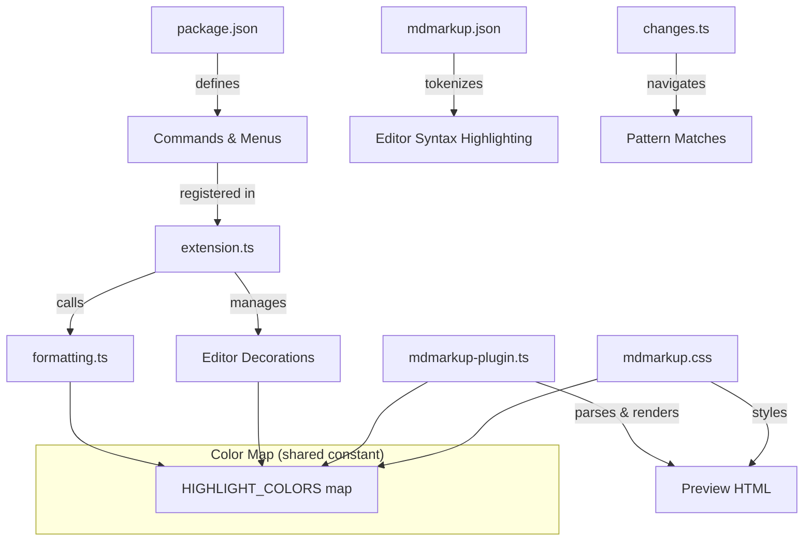

# Design Document: Highlight Colors

## Overview

This feature extends the mdmarkup extension to support colored highlights using the syntax `==text=={color}`. It touches five areas of the codebase:

1. **package.json** — new commands, a submenu, and menu reorganization
2. **src/formatting.ts** — a new `wrapColoredHighlight` function
3. **src/preview/mdmarkup-plugin.ts** — parsing colored highlights and rendering with color-specific CSS classes
4. **media/mdmarkup.css** — CSS classes for each Word highlight color
5. **src/extension.ts** — register color commands, create `TextEditorDecorationType` instances, and update decorations on document change
6. **syntaxes/mdmarkup.json** — TextMate pattern for `==text=={color}`
7. **src/changes.ts** — extend the navigation regex to match `==text=={color}`

The colored highlight syntax `==text=={color}` was chosen because:
- It extends the existing `==text==` format highlight naturally
- The `{color}` suffix is unambiguous — it cannot conflict with CriticMarkup `{==text==}` because CriticMarkup uses `{` *before* `==`, not after
- It is easy to parse: find `==`, content, `==`, then optionally `{identifier}`

## Architecture



The color map is the single source of truth for color name → hex value mappings. It will be defined in a new shared module `src/highlight-colors.ts` and imported by formatting, extension, and preview modules.

## Components and Interfaces

### 1. Color Map Module (`src/highlight-colors.ts`)

New file exporting the color constants:

```typescript
/** Canonical color name → hex value mapping for Word highlight colors */
export const HIGHLIGHT_COLORS: Record<string, string> = {
  'yellow':      '#FFFF00',
  'green':       '#00FF00',
  'turquoise':   '#00FFFF',
  'pink':        '#FF00FF',
  'blue':        '#0000FF',
  'red':         '#FF0000',
  'dark-blue':   '#000080',
  'teal':        '#008080',
  'violet':      '#800080',
  'dark-red':    '#800000',
  'dark-yellow': '#808000',
  'gray-50':     '#808080',
  'gray-25':     '#C0C0C0',
  'black':       '#000000',
};

/**
 * Theme-aware background colors for editor decorations.
 * Light theme: use the raw color at moderate opacity so it's visible on white/light backgrounds.
 * Dark theme: use a tinted/adjusted variant so it's visible on dark backgrounds without washing out text.
 *
 * Format: { light: 'rgba(...)', dark: 'rgba(...)' }
 */
export const HIGHLIGHT_DECORATION_COLORS: Record<string, { light: string; dark: string }> = {
  'yellow':      { light: 'rgba(255, 255, 0, 0.40)',   dark: 'rgba(255, 255, 0, 0.25)' },
  'green':       { light: 'rgba(0, 255, 0, 0.30)',     dark: 'rgba(0, 255, 0, 0.20)' },
  'turquoise':   { light: 'rgba(0, 255, 255, 0.35)',   dark: 'rgba(0, 255, 255, 0.20)' },
  'pink':        { light: 'rgba(255, 0, 255, 0.25)',   dark: 'rgba(255, 0, 255, 0.20)' },
  'blue':        { light: 'rgba(0, 0, 255, 0.20)',     dark: 'rgba(0, 0, 255, 0.30)' },
  'red':         { light: 'rgba(255, 0, 0, 0.25)',     dark: 'rgba(255, 0, 0, 0.25)' },
  'dark-blue':   { light: 'rgba(0, 0, 128, 0.25)',     dark: 'rgba(0, 0, 128, 0.40)' },
  'teal':        { light: 'rgba(0, 128, 128, 0.25)',   dark: 'rgba(0, 128, 128, 0.35)' },
  'violet':      { light: 'rgba(128, 0, 128, 0.25)',   dark: 'rgba(128, 0, 128, 0.35)' },
  'dark-red':    { light: 'rgba(128, 0, 0, 0.25)',     dark: 'rgba(128, 0, 0, 0.40)' },
  'dark-yellow': { light: 'rgba(128, 128, 0, 0.30)',   dark: 'rgba(128, 128, 0, 0.35)' },
  'gray-50':     { light: 'rgba(128, 128, 128, 0.30)', dark: 'rgba(128, 128, 128, 0.35)' },
  'gray-25':     { light: 'rgba(192, 192, 192, 0.40)', dark: 'rgba(192, 192, 192, 0.25)' },
  'black':       { light: 'rgba(0, 0, 0, 0.15)',       dark: 'rgba(0, 0, 0, 0.40)' },
};

/** Default background for CriticMarkup highlights {==text==} (MS Word comment gray) */
export const CRITIC_HIGHLIGHT_BG = '#D9D9D9';
export const CRITIC_HIGHLIGHT_DECORATION = {
  light: 'rgba(217, 217, 217, 0.50)',
  dark: 'rgba(217, 217, 217, 0.30)',
};

/** All valid color identifiers */
export const VALID_COLOR_IDS = Object.keys(HIGHLIGHT_COLORS);

/** Regex fragment matching any valid color id (for use in larger patterns) */
export const COLOR_ID_PATTERN = VALID_COLOR_IDS.map(c => c.replace('-', '\\-')).join('|');

/** Module-level default highlight color, updated from VS Code settings */
let _defaultHighlightColor = 'yellow';
export function setDefaultHighlightColor(color: string): void {
  _defaultHighlightColor = VALID_COLOR_IDS.includes(color) ? color : 'yellow';
}
export function getDefaultHighlightColor(): string {
  return _defaultHighlightColor;
}
```

The key design principle: bright colors (yellow, green, turquoise, pink) use higher opacity on light backgrounds where they need to stand out, and lower opacity on dark backgrounds where they'd otherwise wash out text. Dark colors (dark-blue, teal, violet, dark-red, black) use the inverse — lower opacity on light backgrounds (where the dark tint is already visible) and higher opacity on dark backgrounds (where they'd otherwise disappear).

### 2. Formatting (`src/formatting.ts`)

Add a new function:

```typescript
export function wrapColoredHighlight(text: string, color: string): TextTransformation {
  return {
    newText: `==${text}=={${color}}`,
    cursorOffset: undefined
  };
}
```

This is a thin wrapper. The existing `wrapSelection(text, '==', '==')` continues to handle plain highlights.

### 3. Extension Commands (`src/extension.ts`)

Register 14 new commands, one per color:

```typescript
for (const colorId of VALID_COLOR_IDS) {
  context.subscriptions.push(
    vscode.commands.registerCommand(`mdmarkup.formatHighlight_${colorId}`, () =>
      applyFormatting((text) => formatting.wrapColoredHighlight(text, colorId))
    )
  );
}
```

### 4. Editor Decorations (`src/extension.ts`)

Create decoration types for each color using the VS Code `DecorationRenderOptions` `light` and `dark` properties for theme-appropriate backgrounds:

```typescript
const decorationTypes = new Map<string, vscode.TextEditorDecorationType>();

for (const [colorId, colors] of Object.entries(HIGHLIGHT_DECORATION_COLORS)) {
  decorationTypes.set(colorId, vscode.window.createTextEditorDecorationType({
    light: { backgroundColor: colors.light },
    dark: { backgroundColor: colors.dark },
  }));
}

// Decoration for CriticMarkup highlights {==text==} — Comment_Gray
decorationTypes.set('critic', vscode.window.createTextEditorDecorationType({
  light: { backgroundColor: CRITIC_HIGHLIGHT_DECORATION.light },
  dark: { backgroundColor: CRITIC_HIGHLIGHT_DECORATION.dark },
}));
```

The `light` and `dark` sub-properties of `DecorationRenderOptions` accept `ThemableDecorationRenderOptions`, which includes `backgroundColor`. VS Code automatically applies the correct variant based on the active theme kind. This avoids the problem of a single rgba value being invisible on one theme type.

A `updateHighlightDecorations(editor)` function scans the document text with a regex, groups matches by color, and calls `editor.setDecorations(type, ranges)` for each. For default highlights (`==text==` without a color suffix), the function reads the `mdmarkup.defaultHighlightColor` setting and uses that color's decoration type.

Triggered on:
- `vscode.window.onDidChangeActiveTextEditor`
- `vscode.workspace.onDidChangeTextDocument`

### 5. Preview Plugin (`src/preview/mdmarkup-plugin.ts`)

Extend `parseFormatHighlight` to detect the optional `{color}` suffix after `==`:

```typescript
// After finding closing ==, check for {color}
if (nextChar === '{') {
  // parse color identifier up to }
  const colorId = extractColorId(src, pos + 2);
  if (colorId) {
    tokenOpen.attrSet('class', `mdmarkup-format-highlight mdmarkup-highlight-${colorId}`);
    state.pos = pos + 2 + colorId.length + 2; // skip =={color}
    return true;
  }
}
// No color suffix — default highlight
tokenOpen.attrSet('class', 'mdmarkup-format-highlight');
```

### 6. CSS (`media/mdmarkup.css`)

Add a class for each color with theme-aware variants using `@media (prefers-color-scheme)`. The VS Code Markdown preview respects this media query to switch between light and dark styles.

Light theme uses the raw highlight color at moderate opacity. Dark theme adjusts opacity — lower for bright colors (to avoid washing out light text), higher for dark colors (to remain visible against dark backgrounds):

```css
/* Light theme (default) */
.mdmarkup-highlight-yellow { background-color: rgba(255, 255, 0, 0.40); }
.mdmarkup-highlight-green { background-color: rgba(0, 255, 0, 0.30); }
.mdmarkup-highlight-turquoise { background-color: rgba(0, 255, 255, 0.35); }
.mdmarkup-highlight-pink { background-color: rgba(255, 0, 255, 0.25); }
.mdmarkup-highlight-blue { background-color: rgba(0, 0, 255, 0.20); }
.mdmarkup-highlight-red { background-color: rgba(255, 0, 0, 0.25); }
.mdmarkup-highlight-dark-blue { background-color: rgba(0, 0, 128, 0.25); }
.mdmarkup-highlight-teal { background-color: rgba(0, 128, 128, 0.25); }
.mdmarkup-highlight-violet { background-color: rgba(128, 0, 128, 0.25); }
.mdmarkup-highlight-dark-red { background-color: rgba(128, 0, 0, 0.25); }
.mdmarkup-highlight-dark-yellow { background-color: rgba(128, 128, 0, 0.30); }
.mdmarkup-highlight-gray-50 { background-color: rgba(128, 128, 128, 0.30); }
.mdmarkup-highlight-gray-25 { background-color: rgba(192, 192, 192, 0.40); }
.mdmarkup-highlight-black { background-color: rgba(0, 0, 0, 0.15); }

/* Dark theme overrides */
@media (prefers-color-scheme: dark) {
  .mdmarkup-highlight-yellow { background-color: rgba(255, 255, 0, 0.25); }
  .mdmarkup-highlight-green { background-color: rgba(0, 255, 0, 0.20); }
  .mdmarkup-highlight-turquoise { background-color: rgba(0, 255, 255, 0.20); }
  .mdmarkup-highlight-pink { background-color: rgba(255, 0, 255, 0.20); }
  .mdmarkup-highlight-blue { background-color: rgba(0, 0, 255, 0.30); }
  .mdmarkup-highlight-red { background-color: rgba(255, 0, 0, 0.25); }
  .mdmarkup-highlight-dark-blue { background-color: rgba(0, 0, 128, 0.40); }
  .mdmarkup-highlight-teal { background-color: rgba(0, 128, 128, 0.35); }
  .mdmarkup-highlight-violet { background-color: rgba(128, 0, 128, 0.35); }
  .mdmarkup-highlight-dark-red { background-color: rgba(128, 0, 0, 0.40); }
  .mdmarkup-highlight-dark-yellow { background-color: rgba(128, 128, 0, 0.35); }
  .mdmarkup-highlight-gray-50 { background-color: rgba(128, 128, 128, 0.35); }
  .mdmarkup-highlight-gray-25 { background-color: rgba(192, 192, 192, 0.25); }
  .mdmarkup-highlight-black { background-color: rgba(0, 0, 0, 0.40); }
}
```

Update `.mdmarkup-highlight` (CriticMarkup) to use Comment_Gray with theme-aware opacity:

```css
/* Light theme */
.mdmarkup-highlight { background-color: rgba(217, 217, 217, 0.50); color: inherit; }

/* Dark theme */
@media (prefers-color-scheme: dark) {
  .mdmarkup-highlight { background-color: rgba(217, 217, 217, 0.30); color: inherit; }
}
```

Keep `.mdmarkup-format-highlight` as the existing yellow/amber for plain `==text==` highlights (already theme-aware via CSS variables).

### 7. TextMate Grammar (`syntaxes/mdmarkup.json`)

Add a new pattern for colored highlights that matches before the plain `format_highlight`:

```json
{
  "match": "(?<!\\{)==([^}=]+)==\\{([a-z0-9-]+)\\}",
  "name": "markup.highlight.colored.mdmarkup",
  "captures": {
    "1": { "name": "markup.highlight" },
    "2": { "name": "entity.other.attribute-name.mdmarkup" }
  }
}
```

### 8. Navigation (`src/changes.ts`)

Extend the `combinedPattern` regex to include `==text=={color}`:

```text
==([^}=]+)==\{[a-z0-9-]+\}
```

This is added as an alternative in the combined pattern, before the existing `==text==` pattern (if one exists for navigation), so colored highlights are matched as a unit including their color suffix.

### 9. Package.json Menu Structure

Reorganize the Formatting menu:

- Remove `mdmarkup.formatHighlight` from group `1_format`
- Create new submenu `markdown.highlightColor` with label "Highlight Color"
- Add `mdmarkup.formatHighlight` and `markdown.highlightColor` submenu to a new group `1a_highlight` in `markdown.formatting`
- Add all 14 color commands to the `markdown.highlightColor` submenu

### 10. Configuration (`package.json` contributes.configuration)

Add a new setting for the default highlight color:

```json
{
  "mdmarkup.defaultHighlightColor": {
    "type": "string",
    "enum": ["yellow", "green", "turquoise", "pink", "blue", "red", "dark-blue", "teal", "violet", "dark-red", "dark-yellow", "gray-50", "gray-25", "black"],
    "default": "yellow",
    "description": "Default background color for ==highlight== formatting when no color is specified"
  }
}
```

The preview plugin and editor decoration logic both read this setting to determine which color to apply for `==text==` without a `{color}` suffix.

## Data Models

### Color Map

| Color Name   | Identifier    | Hex Value | Light BG (rgba)              | Dark BG (rgba)               |
|-------------|---------------|-----------|------------------------------|------------------------------|
| Yellow      | `yellow`      | #FFFF00   | rgba(255, 255, 0, 0.40)     | rgba(255, 255, 0, 0.25)     |
| Green       | `green`       | #00FF00   | rgba(0, 255, 0, 0.30)       | rgba(0, 255, 0, 0.20)       |
| Turquoise   | `turquoise`   | #00FFFF   | rgba(0, 255, 255, 0.35)     | rgba(0, 255, 255, 0.20)     |
| Pink        | `pink`        | #FF00FF   | rgba(255, 0, 255, 0.25)     | rgba(255, 0, 255, 0.20)     |
| Blue        | `blue`        | #0000FF   | rgba(0, 0, 255, 0.20)       | rgba(0, 0, 255, 0.30)       |
| Red         | `red`         | #FF0000   | rgba(255, 0, 0, 0.25)       | rgba(255, 0, 0, 0.25)       |
| Dark Blue   | `dark-blue`   | #000080   | rgba(0, 0, 128, 0.25)       | rgba(0, 0, 128, 0.40)       |
| Teal        | `teal`        | #008080   | rgba(0, 128, 128, 0.25)     | rgba(0, 128, 128, 0.35)     |
| Violet      | `violet`      | #800080   | rgba(128, 0, 128, 0.25)     | rgba(128, 0, 128, 0.35)     |
| Dark Red    | `dark-red`    | #800000   | rgba(128, 0, 0, 0.25)       | rgba(128, 0, 0, 0.40)       |
| Dark Yellow | `dark-yellow` | #808000   | rgba(128, 128, 0, 0.30)     | rgba(128, 128, 0, 0.35)     |
| Gray-50%    | `gray-50`     | #808080   | rgba(128, 128, 128, 0.30)   | rgba(128, 128, 128, 0.35)   |
| Gray-25%    | `gray-25`     | #C0C0C0   | rgba(192, 192, 192, 0.40)   | rgba(192, 192, 192, 0.25)   |
| Black       | `black`       | #000000   | rgba(0, 0, 0, 0.15)         | rgba(0, 0, 0, 0.40)         |

CriticMarkup Comment_Gray: `#D9D9D9` → light: `rgba(217, 217, 217, 0.50)`, dark: `rgba(217, 217, 217, 0.30)`

### Syntax Patterns

| Pattern | Example | Meaning |
|---------|---------|---------|
| `==text==` | `==important==` | Default highlight (color from `mdmarkup.defaultHighlightColor` setting, defaults to Yellow) |
| `==text=={color}` | `==important=={yellow}` | Colored highlight |
| `{==text==}` | `{==noted==}` | CriticMarkup highlight (Comment_Gray) |


## Correctness Properties

*A property is a characteristic or behavior that should hold true across all valid executions of a system — essentially, a formal statement about what the system should do. Properties serve as the bridge between human-readable specifications and machine-verifiable correctness guarantees.*

### Property 1: Colored highlight wrapping preserves content and produces correct syntax

*For any* non-empty text string and *for any* valid color identifier from the Word_Highlight_Colors set, calling `wrapColoredHighlight(text, color)` SHALL produce a string of the form `==text=={color}` where the text between the `==` delimiters is exactly the original input.

**Validates: Requirements 1.4, 2.4**

### Property 2: Preview renders colored highlights with correct color class

*For any* text string and *for any* valid color identifier, when the preview plugin parses `==text=={color}`, the resulting HTML SHALL contain a `<mark>` element with CSS class `mdmarkup-highlight-{color}`.

**Validates: Requirements 2.1, 3.1**

### Property 3: Preview renders default format highlights with existing yellow/amber styling

*For any* text string, when the preview plugin parses `==text==` (without a color suffix), the resulting HTML SHALL contain a `<mark>` element with CSS class `mdmarkup-format-highlight` (which maps to the existing yellow/amber background).

**Validates: Requirements 3.2**

### Property 4: Preview renders CriticMarkup highlights with Comment_Gray

*For any* text string, when the preview plugin parses `{==text==}`, the resulting HTML SHALL contain a `<mark>` element with CSS class `mdmarkup-highlight` (which maps to Comment_Gray), not `mdmarkup-format-highlight` or any color-specific class.

**Validates: Requirements 3.3**

### Property 5: Preview falls back to configured default for unrecognized colors (yellow/amber second-level fallback)

*For any* text string and *for any* string that is NOT a valid color identifier, when the preview plugin parses `==text=={invalid}`, the resulting HTML SHALL contain a `<mark>` element with styling derived from the configured default highlight color; if the configured default cannot be resolved, it SHALL fall back to `mdmarkup-format-highlight` (yellow/amber).

**Validates: Requirements 3.4**

### Property 6: Highlight range extraction finds colored highlights and CriticMarkup highlights

*For any* document text containing a mix of colored highlights `==text=={color}` and CriticMarkup highlights `{==text==}`, the extraction function SHALL return colored highlight ranges grouped by color identifier, and CriticMarkup highlight ranges grouped under a `'critic'` key.

**Validates: Requirements 4.1, 4.2, 4.4**

### Property 7: Navigation regex matches colored highlight patterns

*For any* text string and *for any* valid color identifier, the navigation combined regex SHALL match the full `==text=={color}` pattern as a single match.

**Validates: Requirements 7.1**

### Property 8: Overlapping pattern filtering with colored highlights

*For any* document containing both CriticMarkup patterns and colored highlight patterns where ranges overlap, the filtering logic SHALL remove contained ranges and keep only the outermost patterns.

**Validates: Requirements 7.2**

### Property 9: Default highlight color respects configuration

*For any* valid color identifier set as `mdmarkup.defaultHighlightColor`, when the editor decoration logic processes a default highlight `==text==`, it SHALL apply the decoration type corresponding to that configured color.

**Validates: Requirements 8.2, 8.3, 8.4**

## Error Handling

| Scenario | Behavior |
|----------|----------|
| Unrecognized color identifier in `==text=={unknown}` | Treat as configured default highlight color in preview/editor; if configured default cannot be resolved, use yellow/amber fallback |
| Empty text in `==  =={color}` | Wrap/render normally — empty highlights are valid (consistent with existing `==  ==` behavior) |
| Color suffix without closing brace `==text=={yellow` | Do not parse as colored highlight; treat `==text==` as default highlight and leave `{yellow` as literal text |
| Nested highlights `==outer ==inner=={red} outer==` | The inner pattern matches first (greedy left-to-right); outer `==` delimiters become literal text |
| Color command invoked with no selection and no word at cursor | Wrap empty string: `===={color}` with cursor positioned between the `==` delimiters |

## Testing Strategy

### Property-Based Tests (fast-check)

Each correctness property above maps to one property-based test using `fast-check`. Tests run with a minimum of 100 iterations.

- **Property 1**: Generate random strings and random valid color IDs → verify `wrapColoredHighlight` output structure
- **Property 2**: Generate random strings and valid color IDs → feed `==text=={color}` through the markdown-it plugin → verify output HTML class
- **Property 3**: Generate random strings → feed `==text==` through the plugin → verify output HTML class is `mdmarkup-format-highlight` (yellow/amber)
- **Property 4**: Generate random strings → feed `{==text==}` through the plugin → verify output HTML class is `mdmarkup-highlight` (Comment_Gray)
- **Property 5**: Generate random strings and random *invalid* color IDs → feed through plugin → verify fallback follows configured default color (and `mdmarkup-format-highlight` only when default is unresolved)
- **Property 6**: Generate documents with random highlight patterns → run extraction → verify colored highlights grouped by color and CriticMarkup highlights grouped under `'critic'`
- **Property 7**: Generate random strings and valid color IDs → test regex match
- **Property 8**: Generate documents with overlapping patterns → run filtering → verify no contained duplicates

### Unit Tests

- Verify all 14 color commands are registered in package.json
- Verify the Highlight_Color_Submenu structure in package.json
- Verify the TextMate grammar pattern matches colored highlights and captures groups correctly
- Verify edge cases: empty text, missing closing brace, nested patterns
- Verify decoration types are created for all colors plus default

### Testing Library

- **Property-based testing**: `fast-check` (already a devDependency)
- **Test runner**: `bun test` (already configured)
- **Tag format**: `Feature: highlight-colors, Property N: {property_text}`
- Each correctness property is implemented by a SINGLE property-based test
- Use bounded string generators (maxLength: 50) to avoid timeouts per AGENTS.md learnings
