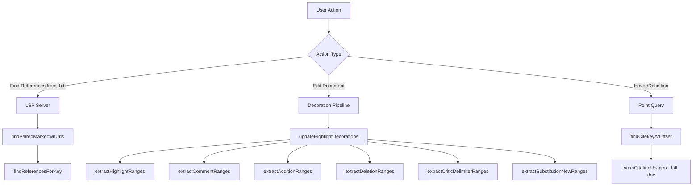
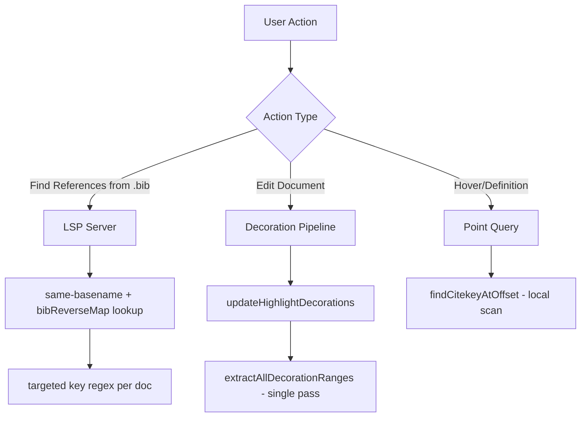

# Design Document: LSP Performance Optimization

## Overview

This design addresses ten findings across the Manuscript Markdown VS Code extension: LSP server reference lookups, editor decoration extraction, citation scanning, bib revalidation, CriticMarkup preprocessing, preview parsing, TextMate grammar injection ordering, and a TextMate grammar bug where CriticMarkup patterns incorrectly apply inside code blocks.

The changes are scoped to existing files — no new modules are introduced. The core strategy is: remove unnecessary work (workspace scan), replace broad scans with targeted lookups, consolidate multiple passes into single passes, and fix algorithmic complexity where it matters.

## Architecture

The extension has three main performance-sensitive paths:



After optimization:



## Components and Interfaces

### 1. Bib Reverse Map (`src/lsp/server.ts`)

Use a reverse map plus a forward map:
- `Map<string, Set<string>>` mapping canonical bib paths to open markdown document URIs
- `Map<string, string>` mapping markdown doc URIs to canonical bib paths

```typescript
// canonical bib path → set of markdown doc URIs
const bibReverseMap = new Map<string, Set<string>>();
// markdown doc URI → canonical bib path
const docToBibMap = new Map<string, string>();

function updateBibReverseMap(docUri: string, docText: string): void {
  // Remove doc from any existing entries
  removeBibReverseMapEntry(docUri);
  // Resolve and add to new bib path
  const bibPath = resolveBibliographyPath(docUri, docText, workspaceRootPaths);
  if (bibPath) {
    const canonical = canonicalizeFsPath(bibPath);
    if (!bibReverseMap.has(canonical)) {
      bibReverseMap.set(canonical, new Set());
    }
    bibReverseMap.get(canonical)!.add(docUri);
    docToBibMap.set(docUri, canonical);
  }
}

function removeBibReverseMapEntry(docUri: string): void {
  const canonical = docToBibMap.get(docUri);
  if (!canonical) return;
  docToBibMap.delete(docUri);
  const uris = bibReverseMap.get(canonical);
  if (!uris) return;
  uris.delete(docUri);
  if (uris.size === 0) {
    bibReverseMap.delete(canonical);
  }
}

function getMarkdownUrisForBib(canonicalBibPath: string): Set<string> {
  return bibReverseMap.get(canonicalBibPath) ?? new Set();
}
```

Lifecycle hooks:
- `documents.onDidOpen` → call `updateBibReverseMap(doc.uri, doc.getText())`
- `documents.onDidChangeContent` (for markdown) → call `updateBibReverseMap(doc.uri, doc.getText())`
- `documents.onDidClose` (for markdown) → call `removeBibReverseMapEntry(doc.uri)`

### 2. Simplified `findPairedMarkdownUris` (`src/lsp/server.ts`)

Remove the recursive workspace scan (step 3). Use same-basename check + bibReverseMap.

```typescript
async function findPairedMarkdownUris(bibPath: string): Promise<string[]> {
  const urisByCanonicalPath = new Map<string, string>();
  const bibCanonical = canonicalizeFsPath(bibPath);

  // 1. Same-basename: paper.bib → paper.md
  const dir = path.dirname(bibPath);
  const base = path.basename(bibPath, path.extname(bibPath));
  const sameBaseMd = path.join(dir, base + '.md');
  try {
    await fsp.stat(sameBaseMd);
    const canonical = canonicalizeFsPath(sameBaseMd);
    urisByCanonicalPath.set(canonical, fsPathToUri(sameBaseMd));
  } catch { /* file doesn't exist */ }

  // 2. Open docs from reverse map
  for (const docUri of getMarkdownUrisForBib(bibCanonical)) {
    const fsPath = uriToFsPath(docUri);
    if (fsPath) {
      const canonical = canonicalizeFsPath(fsPath);
      if (!urisByCanonicalPath.has(canonical)) {
        urisByCanonicalPath.set(canonical, docUri);
      }
    }
  }

  return [...urisByCanonicalPath.values()];
}
```

Scope limitation (intentional): `findPairedMarkdownUris` returns only (1) same-basename `.md` and (2) currently open markdown docs from `getMarkdownUrisForBib(...)`, deduped by `canonicalizeFsPath`. Closed non-matching-basename markdown files are not returned to avoid workspace scans.

### 3. Targeted Key Scanner (`src/lsp/server.ts`)

Replace `scanCitationUsages(text).filter(u => u.key === key)` with a targeted regex.

```typescript
function findUsagesForKey(text: string, key: string): CitekeyUsage[] {
  const escaped = key.replace(/[.*+?^${}()|[\]\\]/g, '\\$&');
  const segRe = /\\[[^\\]]*@[^\\]]*\\]/g;
  const keyRe = new RegExp(`@${escaped}(?![A-Za-z0-9_:-])`, 'g');
  const usages: CitekeyUsage[] = [];
  let segMatch: RegExpExecArray | null;
  segRe.lastIndex = 0;
  while ((segMatch = segRe.exec(text)) !== null) {
    const inner = segMatch[0].slice(1, -1);
    const segmentOffset = segMatch.index + 1;
    keyRe.lastIndex = 0;
    let keyMatch: RegExpExecArray | null;
    while ((keyMatch = keyRe.exec(inner)) !== null) {
      const keyStart = segmentOffset + keyMatch.index + 1;
      usages.push({ key, keyStart, keyEnd: keyStart + key.length });
    }
  }
  return usages;
}
```

### 4. Single-Pass Decoration Extractor (`src/highlight-colors.ts`)

Replace the six separate extraction functions called from `updateHighlightDecorations` with a single function that scans the text once and categorizes all ranges.

```typescript
interface AllDecorationRanges {
  highlights: Map<string, Array<{ start: number; end: number }>>;  // color → ranges
  comments: Array<{ start: number; end: number }>;
  additions: Array<{ start: number; end: number }>;
  deletions: Array<{ start: number; end: number }>;
  delimiters: Array<{ start: number; end: number }>;
  substitutionNew: Array<{ start: number; end: number }>;
}

function extractAllDecorationRanges(text: string, defaultColor: string): AllDecorationRanges { ... }
```

The implementation scans character-by-character, matching opening delimiters `{++`, `{--`, `{~~`, `{>>`, `{==`, and `==` (for format highlights). On each match it finds the corresponding close, records the appropriate range category, and advances past the match. CriticMarkup highlight ranges are tracked to exclude overlapping format highlights (same logic as current, but inline rather than post-hoc `.some()` check).

### 5. Two-Pointer Overlap Check (`src/highlight-colors.ts`)

If the single-pass approach is adopted (Requirement 3), the containment check becomes inline. For the standalone `extractHighlightRanges` function (which may still be used in tests or other contexts), use a pointer sweep that preserves `.some()` containment semantics:

```typescript
// Both criticRanges and hlMatches are in scan order (ascending start position)
let cPtr = 0;
for (const hlMatch of hlMatches) {
  const mStart = hlMatch.index;
  const mEnd = mStart + hlMatch[0].length;
  // Advance critic pointer past ranges that end before this highlight
  while (cPtr < criticRanges.length && criticRanges[cPtr].end + 3 < mStart) {
    cPtr++;
  }
  // Check containment against current critic range
  const insideCritic = cPtr < criticRanges.length &&
    (criticRanges[cPtr].start - 3) <= mStart && mEnd <= (criticRanges[cPtr].end + 3);
  if (insideCritic) continue;
  // ... record highlight
}
```

### 6. Local Citekey Resolution (`src/lsp/citekey-language.ts`)

Replace the full-document `scanCitationUsages` call in `findCitekeyAtOffset` with a bounded local scan:

```typescript
function findCitekeyAtOffset(text: string, offset: number): string | undefined {
  const maxScanDistance = 500;
  let scanStart = offset;
  let scanEnd = offset;
  // Prefer nearby bracket-bounded scan (can span newlines)
  const openBracket = text.lastIndexOf('[', offset);
  const closeBracketBefore = text.lastIndexOf(']', Math.max(0, offset - 1));
  if (openBracket !== -1 && openBracket > closeBracketBefore && (offset - openBracket) <= maxScanDistance) {
    const closeBracket = text.indexOf(']', offset);
    if (closeBracket !== -1 && (closeBracket - offset) <= maxScanDistance) {
      scanStart = openBracket;
      scanEnd = closeBracket + 1;
    }
  }
  // Fallback to same-line bounded scan
  if (scanStart === offset && scanEnd === offset) {
    while (scanStart > 0 && text[scanStart - 1] !== '[' && text[scanStart - 1] !== '\n') scanStart--;
    if (scanStart > 0 && text[scanStart - 1] === '[') scanStart--;
    while (scanEnd < text.length && text[scanEnd] !== ']' && text[scanEnd] !== '\n') scanEnd++;
    if (scanEnd < text.length && text[scanEnd] === ']') scanEnd++;
  }

  const segment = text.slice(scanStart, scanEnd);
  for (const usage of scanCitationUsages(segment)) {
    const absStart = usage.keyStart + scanStart;
    const absEnd = usage.keyEnd + scanStart;
    if (offset >= absStart - 1 && offset <= absEnd) {
      return usage.key;
    }
  }
  return undefined;
}
```

### 7. Streaming CriticMarkup Preprocessor (`src/critic-markup.ts`)

Replace the repeated `result.slice(0, contentStart) + replaced + result.slice(closeIdx)` pattern with a segment-collecting approach:

```typescript
function preprocessCriticMarkup(markdown: string): string {
  // Fast path unchanged
  if (!markdown.includes('{++') && ...) return markdown;

  // Single pass: scan for all CriticMarkup openings, collect segments
  const segments: string[] = [];
  let lastPos = 0;
  // ... scan through text, when a span with \n\n is found:
  //   segments.push(markdown.slice(lastPos, contentStart));
  //   segments.push(content.replace(/\n\n/g, PARA_PLACEHOLDER));
  //   lastPos = closeIdx;
  segments.push(markdown.slice(lastPos));
  return segments.join('');
}
```

### 8. Preview Parser Micro-Optimizations (`src/preview/manuscript-markdown-plugin.ts`)

- In `manuscriptMarkdownBlock`: replace `src.slice(pos, Math.min(pos + 3, max))` + `patterns.includes(lineStart)` with direct charCode checks on `src.charCodeAt(pos)`, `src.charCodeAt(pos+1)`, `src.charCodeAt(pos+2)`.
- In `parseManuscriptMarkdown`: already uses charCode checks (good). Ensure `indexOf` calls for closing markers use `state.posMax` as an upper bound where possible (note: `String.indexOf` doesn't accept an end bound, but we can check `endPos <= state.posMax` after finding).
- These are minor wins; the parser is already reasonably efficient for typical file sizes.

### 9. TextMate Grammar Pattern Ordering (`syntaxes/manuscript-markdown.json`)

Reorder the `patterns` array to put the most common and cheapest patterns first:

```json
"patterns": [
    { "include": "#citation_list" },
    { "include": "#footnote_ref" },
    { "include": "#footnote_def" },
    { "include": "#colored_format_highlight" },
    { "include": "#format_highlight" },
    { "include": "#addition" },
    { "include": "#deletion" },
    { "include": "#substitution" },
    { "include": "#highlight" },
    { "include": "#comment_with_id" },
    { "include": "#comment" },
    { "include": "#comment_range_start" },
    { "include": "#comment_range_end" }
]
```

Rationale: `citation_list` and `footnote_ref`/`footnote_def` use simple `match` patterns with anchored starts (`\[` or `^`), so they fail fast. CriticMarkup `begin`/`end` patterns are more expensive due to multi-line scanning. Colored format highlights must precede plain format highlights (existing constraint from AGENTS.md).

Also tighten the `format_highlight` match to use a more restrictive character class if profiling shows it's a hot spot.

### 10. TextMate Grammar Code Scope Exclusion (`syntaxes/manuscript-markdown.json`)

The current injection selector `L:text.html.markdown` injects into the entire markdown scope, including inline code spans and fenced code blocks. This causes CriticMarkup-like syntax in code (e.g. `{--...--}` in TypeScript snippets) to be incorrectly tokenized as deletions/additions/etc.

Fix: Update the `injectionSelector` to exclude code-related scopes:

```json
"injectionSelector": "L:text.html.markdown -string -meta.embedded -markup.inline.raw -markup.fenced_code"
```

This tells VS Code to inject the grammar into markdown text but skip:
- `string` — string literals in embedded languages
- `meta.embedded` — embedded language blocks
- `markup.inline.raw` — inline code (backtick spans)
- `markup.fenced_code` — fenced code blocks

No changes to individual pattern definitions are needed — the scope exclusion at the injection level prevents all grammar patterns from matching inside code, including CriticMarkup (`{--...--}`, `{++...++}`, etc.), format highlights (`==text==`, `==text=={color}`), citations (`[@key]`), and footnote references (`[^ref]`).

## Data Models

No new persistent data models. The Bib Reverse Map and any caches are in-memory `Map` structures within the LSP server process, scoped to the server lifecycle.

### Bib Reverse Map

```typescript
// Key: canonical bib file path (via canonicalizeFsPath)
// Value: set of markdown document URIs (as strings)
Map<string, Set<string>>
```

### All Decoration Ranges (return type of single-pass extractor)

```typescript
interface AllDecorationRanges {
  highlights: Map<string, Array<{ start: number; end: number }>>;
  comments: Array<{ start: number; end: number }>;
  additions: Array<{ start: number; end: number }>;
  deletions: Array<{ start: number; end: number }>;
  delimiters: Array<{ start: number; end: number }>;
  substitutionNew: Array<{ start: number; end: number }>;
}
```


## Correctness Properties

*A property is a characteristic or behavior that should hold true across all valid executions of a system — essentially, a formal statement about what the system should do. Properties serve as the bridge between human-readable specifications and machine-verifiable correctness guarantees.*

Since this is a refactoring/optimization effort, the core correctness concern is behavioral equivalence: optimized code paths must produce identical results to the original implementations. Most properties below are therefore equivalence properties comparing old and new implementations.

### Property 1: Canonical Path Deduplication

*For any* two collections of markdown file URIs (from same-basename check and reverse-map lookup), if any URIs in the combined set resolve to the same canonical filesystem path, `findPairedMarkdownUris` should return exactly one URI per unique canonical path.

**Validates: Requirements 1.4**

### Property 2: Targeted Key Scanner Equivalence

*For any* document text containing citation segments and *for any* citekey string (including keys with regex-special characters like `.`, `+`, `(`), the targeted key scanner should return the same set of `{keyStart, keyEnd}` locations as `scanCitationUsages(text).filter(u => u.key === key)`.

**Validates: Requirements 2.1, 2.2, 2.3**

### Property 3: Single-Pass Decoration Extraction Equivalence

*For any* document text, `extractAllDecorationRanges(text, defaultColor)` should produce highlight ranges (by color), comment ranges, addition ranges, deletion ranges, delimiter ranges, and substitution-new ranges identical to calling `extractHighlightRanges`, `extractCommentRanges`, `extractAdditionRanges`, `extractDeletionRanges`, `extractCriticDelimiterRanges`, and `extractSubstitutionNewRanges` individually.

**Validates: Requirements 3.1, 3.2, 3.3**

### Property 4: Two-Pointer Overlap Exclusion Equivalence

*For any* document text containing both CriticMarkup highlights (`{==...==}`) and format highlights (`==...==` or `==...=={color}`), the two-pointer overlap check in `extractHighlightRanges` should produce the same set of non-overlapping format highlight ranges as the original `.some()` approach.

**Validates: Requirements 4.1, 4.2**

### Property 5: Local Citekey Resolution Equivalence

*For any* document text and *for any* offset within that text, the bounded local `findCitekeyAtOffset(text, offset)` should return the same result (key string or undefined) as the original full-document-scan implementation.

**Validates: Requirements 5.1, 5.2, 5.3**

### Property 6: Streaming Preprocessor Equivalence

*For any* markdown text (including texts with nested `{>>...<<}` patterns, `{#id>>...<<}` patterns, and multiple CriticMarkup spans containing `\n\n`), the streaming-builder `preprocessCriticMarkup` should produce output identical to the original slice-and-rebuild implementation.

**Validates: Requirements 7.1, 7.2**

## Error Handling

- **Bib Reverse Map**: If `resolveBibliographyPath` throws during map update (e.g., filesystem error), catch the error, log it via `connection.console.error`, and skip the map update for that document. The map remains consistent (the document simply won't appear in lookups until the next successful update).
- **Targeted Key Scanner**: If the regex construction fails (shouldn't happen with proper escaping, but defensively), fall back to the original `scanCitationUsages` + filter approach.
- **Single-Pass Tokenizer**: If the single-pass extractor encounters an unexpected state (e.g., malformed CriticMarkup with no closing delimiter), it should skip the unclosed pattern and continue scanning, matching the behavior of the individual extractors which use `indexOf` and skip on `-1`.
- **Local Citekey Resolution**: If the bounded scan region is empty or malformed, return `undefined` (same as current behavior for no match).
- **Streaming Preprocessor**: The fast-path check (no CriticMarkup markers) is preserved. If segment collection encounters an error, the function should return the original input unchanged.

## Testing Strategy

### Property-Based Testing

Use `fast-check` as the property-based testing library (already available in the project via `bun test`).

Each property test should run a minimum of 100 iterations. Tests should be tagged with comments referencing the design property.

**Generators needed:**
- Markdown text with citation segments: `[@key1; @key2]` with random keys (including keys with special regex characters)
- Markdown text with CriticMarkup patterns: `{++...++}`, `{--...--}`, `{~~...~>...~~}`, `{>>...<<}`, `{==...==}`, `==...==`, `==...=={color}`, nested `{>>...{>>...<<}...<<}`
- Random offsets within generated text
- Sets of file URIs with overlapping canonical paths

**Generator constraints (per AGENTS.md):** Use bounded string generators to avoid timeouts on large generated strings. Prefer `fc.string({ maxLength: 500 })` or similar constraints.

### Unit Tests

Unit tests complement property tests for:
- Specific examples of `findPairedMarkdownUris` with same-basename and reverse-map scenarios (Requirements 1.1, 1.2, 1.3)
- Bib reverse map lifecycle: add, update, remove (Requirements 6.1, 6.2, 6.3)
- Preview parser charCode optimization produces unchanged output for known inputs (Requirements 8.1, 8.2, 8.3)
- TextMate grammar pattern ordering is correct in the JSON file (Requirement 9.1)

### Test Configuration

- Property tests: minimum 100 iterations per property, tagged with `Feature: lsp-performance-optimization, Property N: {title}`
- Unit tests: focused on specific examples, edge cases, integration points
- All tests run via `bun test`
