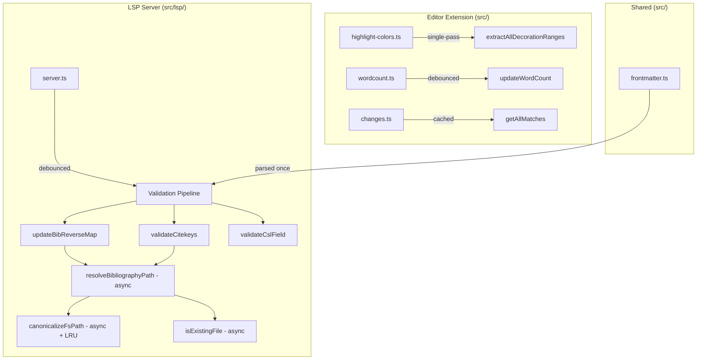

# Design Document: LSP Performance Phase 2

## Overview

This design addresses six remaining performance hot paths in the Manuscript Markdown VS Code extension that were not covered by Phase 1 optimizations:

1. **Debounced LSP validation** — `onDidChangeContent` fires the full validation pipeline synchronously on every keystroke
2. **Async filesystem calls** — `canonicalizeFsPath()` and `isExistingFile()` use blocking `fs.realpathSync.native()` and `fs.statSync()` on the LSP thread
3. **Single-pass decoration extraction** — `extractAllDecorationRanges()` delegates highlight extraction to a separate multi-pass function that scans the document 4+ times
4. **Debounced word count** — `WordCountController` re-counts the entire document on every keystroke and cursor movement
5. **Cached navigation matches** — `getAllMatches()` re-runs a complex regex on the full document for every next/prev command
6. **Shared frontmatter parse** — `parseFrontmatter()` is called 3 times per validation cycle (once each in `updateBibReverseMap`, `validateCitekeys`, `validateCslField`)

All changes are internal refactors with no user-facing API changes. The existing individual extraction functions (`extractHighlightRanges`, `extractCommentRanges`, etc.) are preserved for tests and other callers.

## Architecture

The changes span three layers of the extension:



### Design Decisions

1. **Debounce interval of 300ms for LSP validation**: Balances responsiveness with CPU savings. Standard for LSP servers (TypeScript LSP uses 200-300ms). Configurable for future tuning.

2. **LRU cache (max 256 entries) for canonicalizeFsPath**: Filesystem paths are stable during a session. 256 entries covers typical workspace sizes. Invalidated on `.bib` file change events.

3. **Single-pass char-by-char scanner for decorations**: The existing `extractAllDecorationRanges` already does a char-by-char loop for additions/deletions/substitutions/comments. Highlights can be folded into the same loop. The key constraint from AGENTS.md: format highlights `==...==` inside any CriticMarkup span (including critic highlights `{==...==}`, additions `{++...++}`, deletions `{--...--}`, etc.) must still be detected. No CriticMarkup span type suppresses nested format highlights.

4. **500ms debounce for word count**: Word count is informational, not latency-sensitive. 500ms prevents re-counting on every keystroke while keeping the display reasonably current.

5. **Version-keyed cache for navigation matches**: `getAllMatches` is called from `next()` and `prev()` which may fire rapidly. Cache keyed by `(documentUri, documentVersion)` avoids redundant regex scans.

6. **Pre-parsed frontmatter passed through validation pipeline**: Instead of a global cache, the debounced handler parses frontmatter once and passes it as an optional parameter to each validation function. This is simpler and avoids cache invalidation complexity.

## Components and Interfaces

### 1. Debounced Validation (src/lsp/server.ts)

```typescript
// New: per-document debounce timer map
const validationTimers = new Map<string, ReturnType<typeof setTimeout>>();
const VALIDATION_DEBOUNCE_MS = 300;

// Modified: onDidChangeContent uses debounce
documents.onDidChangeContent((event) => {
  // ... bib handling unchanged ...
  if (isMarkdownUri(event.document.uri, event.document.languageId)) {
    scheduleValidation(event.document.uri);
  }
});

// New: debounce scheduler
function scheduleValidation(uri: string): void {
  const existing = validationTimers.get(uri);
  if (existing) clearTimeout(existing);
  validationTimers.set(uri, setTimeout(() => {
    validationTimers.delete(uri);
    const doc = documents.get(uri);
    if (doc) runValidationPipeline(doc);
  }, VALIDATION_DEBOUNCE_MS));
}

// New: unified pipeline with shared frontmatter parse
async function runValidationPipeline(doc: TextDocument): Promise<void> {
  const text = doc.getText();
  const { metadata } = parseFrontmatter(text);
  updateBibReverseMap(doc.uri, text, metadata);
  await validateCitekeys(doc, metadata);
  await validateCslField(doc, metadata);
}

// Unchanged: onDidOpen runs immediately
documents.onDidOpen((event) => {
  if (isMarkdownUri(event.document.uri, event.document.languageId)) {
    runValidationPipeline(event.document);
  }
});
```

### 2. Async Filesystem Calls (src/lsp/citekey-language.ts)

```typescript
import * as fsp from 'fs/promises';

// LRU cache for canonicalized paths
class LruCache<K, V> {
  private map = new Map<K, V>();
  constructor(private maxSize: number) {}
  get(key: K): V | undefined {
    const v = this.map.get(key);
    if (v !== undefined) {
      // Move to end (most recently used)
      this.map.delete(key);
      this.map.set(key, v);
    }
    return v;
  }
  set(key: K, value: V): void {
    this.map.delete(key);
    this.map.set(key, value);
    if (this.map.size > this.maxSize) {
      const first = this.map.keys().next().value;
      if (first !== undefined) this.map.delete(first);
    }
  }
  delete(key: K): void { this.map.delete(key); }
  clear(): void { this.map.clear(); }
}

const canonicalCache = new LruCache<string, string>(256);

// New async version
export async function canonicalizeFsPathAsync(fsPath: string): Promise<string> {
  let value = path.resolve(fsPath);
  const cached = canonicalCache.get(value);
  if (cached !== undefined) return cached;
  try {
    value = await fsp.realpath(value);
  } catch {
    // keep resolved path
  }
  value = path.normalize(value);
  if (process.platform === 'win32' || process.platform === 'darwin') {
    value = value.toLowerCase();
  }
  canonicalCache.set(path.resolve(fsPath), value);
  return value;
}

// Keep sync version for backward compatibility (non-LSP callers)
export function canonicalizeFsPath(fsPath: string): string { /* unchanged */ }

// Invalidation hook
export function invalidateCanonicalCache(fsPath: string): void {
  canonicalCache.delete(path.resolve(fsPath));
}

// New async version
async function isExistingFileAsync(filePath: string): Promise<boolean> {
  try {
    return (await fsp.stat(filePath)).isFile();
  } catch {
    return false;
  }
}

// New async version with optional pre-parsed metadata
export async function resolveBibliographyPathAsync(
  markdownUri: string,
  markdownText: string,
  workspaceRootPaths: string[],
  metadata?: Frontmatter
): Promise<string | undefined> {
  const markdownPath = uriToFsPath(markdownUri);
  if (!markdownPath) return undefined;

  const basePath = markdownPath.replace(/\.md$/i, '');
  const markdownDir = path.dirname(basePath);
  const fm = metadata ?? parseFrontmatter(markdownText).metadata;

  const candidates: string[] = [];
  if (fm.bibliography) {
    const bibFile = normalizeBibPath(fm.bibliography);
    const isRootRelative = bibFile.startsWith('/');
    if (isRootRelative) {
      const rel = bibFile.slice(1);
      for (const root of workspaceRootPaths) candidates.push(path.join(root, rel));
      candidates.push(bibFile);
    } else if (path.isAbsolute(bibFile)) {
      candidates.push(bibFile);
    } else {
      candidates.push(path.join(markdownDir, bibFile));
      for (const root of workspaceRootPaths) candidates.push(path.join(root, bibFile));
    }
  }
  candidates.push(basePath + '.bib');

  const unique = [...new Set(candidates)];
  for (const c of unique) {
    if (await isExistingFileAsync(c)) return c;
  }
  return undefined;
}
```

### 3. Single-Pass Decoration Extraction (src/highlight-colors.ts)

The existing char-by-char loop in `extractAllDecorationRanges` is extended to also detect:
- `{==...==}` critic highlights (already skipped in the loop, now records content range)
- `==...==` and `==...=={color}` format highlights (new detection within the same loop)

Key constraint: format highlights inside any CriticMarkup span (including `{==...==}`, `{++...++}`, `{--...--}`, `{~~...~~}`) must still be detected. No CriticMarkup span type suppresses nested format highlights.

```typescript
export function extractAllDecorationRanges(text: string, defaultColor: string): AllDecorationRanges {
  const resolvedDefault = VALID_COLOR_IDS.includes(defaultColor) ? defaultColor : 'yellow';
  const highlights = new Map<string, Array<{ start: number; end: number }>>();
  // ... other arrays ...

  const push = (key: string, start: number, end: number) => {
    if (!highlights.has(key)) highlights.set(key, []);
    highlights.get(key)!.push({ start, end });
  };

  let i = 0;
  while (i < len) {
    if (text.charCodeAt(i) === 0x7B && i + 2 < len) {
      // ... existing CriticMarkup detection ...
      // {== now records critic highlight content range
      if (c2 === 0x3D && c3 === 0x3D) {
        const ci = text.indexOf('==}', i + 3);
        if (ci !== -1) {
          push('critic', i + 3, ci);
          i = ci + 3; continue;
        }
      }
    }
    // New: detect format highlights ==...== outside CriticMarkup
    if (text.charCodeAt(i) === 0x3D && i + 1 < len && text.charCodeAt(i + 1) === 0x3D
        && (i === 0 || text.charCodeAt(i - 1) !== 0x7B)) {
      // scan for closing == and optional {color}
      // ... format highlight detection logic ...
    }
    i++;
  }
}
```

### 4. Debounced Word Count (src/wordcount.ts)

```typescript
private debounceTimer: ReturnType<typeof setTimeout> | undefined;
private static readonly DEBOUNCE_MS = 500;

// onDidChangeTextDocument → debounced
vscode.workspace.onDidChangeTextDocument(() => {
  this.scheduleUpdate();
});

// onDidChangeActiveTextEditor → immediate
vscode.window.onDidChangeActiveTextEditor(() => {
  this.updateWordCount();
});

// onDidChangeTextEditorSelection (debounced)
vscode.window.onDidChangeTextEditorSelection(() => {
  this.scheduleUpdate();
});

private scheduleUpdate(): void {
  if (this.debounceTimer) clearTimeout(this.debounceTimer);
  this.debounceTimer = setTimeout(() => {
    this.debounceTimer = undefined;
    this.updateWordCount();
  }, WordCountController.DEBOUNCE_MS);
}
```

### 5. Cached Navigation Matches (src/changes.ts)

```typescript
let cachedUri: string | undefined;
let cachedVersion: number | undefined;
let cachedRanges: vscode.Range[] | undefined;

export function getAllMatches(document: vscode.TextDocument): vscode.Range[] {
  const uri = document.uri.toString();
  const version = document.version;
  if (cachedUri === uri && cachedVersion === version && cachedRanges) {
    return cachedRanges;
  }

  // ... existing regex scan + filtering ...

  cachedUri = uri;
  cachedVersion = version;
  cachedRanges = filteredRanges;
  return filteredRanges;
}
```

### 6. Shared Frontmatter Parse (src/lsp/server.ts + citekey-language.ts)

Function signatures updated to accept optional pre-parsed metadata:

```typescript
// citekey-language.ts
export async function resolveBibliographyPathAsync(
  markdownUri: string,
  markdownText: string,
  workspaceRootPaths: string[],
  metadata?: Frontmatter  // optional pre-parsed
): Promise<string | undefined>;

// server.ts
function updateBibReverseMap(docUri: string, docText: string, metadata?: Frontmatter): void;
async function validateCitekeys(doc: TextDocument, metadata?: Frontmatter): Promise<void>;
async function validateCslField(doc: TextDocument, metadata?: Frontmatter): Promise<void>;
```

## Data Models

### LRU Cache

```typescript
class LruCache<K, V> {
  private map: Map<K, V>;  // insertion-ordered Map used as LRU
  private maxSize: number;

  get(key: K): V | undefined;
  set(key: K, value: V): void;
  delete(key: K): void;
  clear(): void;
}
```

Used for `canonicalCache` (max 256 entries, keyed by `path.resolve(fsPath)`).

### Navigation Cache

```typescript
// Module-level state in changes.ts
let cachedUri: string | undefined;
let cachedVersion: number | undefined;
let cachedRanges: vscode.Range[] | undefined;
```

Single-document cache. Discarded when document URI or version changes.

### Debounce Timer Maps

```typescript
// LSP validation: per-document timers
const validationTimers: Map<string, ReturnType<typeof setTimeout>>;

// Word count: single timer (only one active editor)
private debounceTimer: ReturnType<typeof setTimeout> | undefined;
```


## Correctness Properties

*A property is a characteristic or behavior that should hold true across all valid executions of a system — essentially, a formal statement about what the system should do. Properties serve as the bridge between human-readable specifications and machine-verifiable correctness guarantees.*

### Property 1: Debounce consolidates rapid changes

*For any* sequence of N content change events (N ≥ 1) arriving within the debounce interval, the validation pipeline should execute exactly once, using the text from the final change event.

**Validates: Requirements 1.1, 1.2, 1.3**

### Property 2: LRU cache returns correct canonical paths

*For any* filesystem path string, `canonicalizeFsPathAsync(p)` should return the same value as `canonicalizeFsPath(p)` (the existing sync implementation). Additionally, *for any* sequence of more than 256 distinct path lookups, the cache size should never exceed 256 entries.

**Validates: Requirements 2.3**

### Property 3: Single-pass decoration extraction equivalence

*For any* input text string and valid default color, the single-pass `extractAllDecorationRanges(text, color)` should produce highlight ranges identical to those returned by the standalone `extractHighlightRanges(text, color)` function (the current multi-pass implementation). This includes critic highlights `{==...==}`, format highlights `==...==`, colored highlights `==...=={color}`, and format highlights nested inside any CriticMarkup span (including `{==...==}`).

**Validates: Requirements 3.1, 3.2, 3.3, 3.4**

### Property 4: Word count debounce consolidates rapid text changes

*For any* sequence of N text document change events (N ≥ 1) arriving within the debounce interval, `updateWordCount()` should execute exactly once after the interval elapses.

**Validates: Requirements 4.1, 4.2**

### Property 5: Selection changes trigger debounced word count update

*For any* selection change event (whether selections are empty or non-empty), the Word_Count_Controller SHALL schedule a debounced update so the status bar resets to the full-document word count when a selection is cleared. *For any* selection change event where at least one selection is non-empty, the update is likewise debounced.

**Validates: Requirements 4.4, 4.5**

### Property 6: Navigation cache correctness and idempotence

*For any* document text, calling `getAllMatches(doc)` twice with the same document version should return identical range arrays. *For any* two calls with different document versions, the second call should return results matching a fresh regex scan of the new text.

**Validates: Requirements 5.2, 5.3**

### Property 7: Pre-parsed frontmatter equivalence

*For any* markdown text containing valid YAML frontmatter, calling `resolveBibliographyPathAsync(uri, text, roots, parseFrontmatter(text).metadata)` should return the same result as calling `resolveBibliographyPathAsync(uri, text, roots)` (without pre-parsed metadata). The same equivalence holds for `validateCslField` and `updateBibReverseMap`.

**Validates: Requirements 6.1, 6.2, 6.3, 6.4**

## Error Handling

### Debounce Timer Cleanup
- On `documents.onDidClose`, cancel any pending debounce timer for that URI and remove it from the timer map.
- On LSP shutdown, clear all pending timers.

### Async Filesystem Errors
- `canonicalizeFsPathAsync`: catch `realpath` errors (file not found, permission denied) and fall back to `path.resolve()` + `path.normalize()`, same as the sync version.
- `isExistingFileAsync`: catch `stat` errors and return `false`, same as the sync version.
- All async callers already have try/catch blocks; the async conversion preserves existing error handling semantics.

### LRU Cache Consistency
- Cache entries are never stale for the same process lifetime because filesystem paths don't change unless files are moved/deleted.
- `.bib` file change events trigger `invalidateCanonicalCache()` for the changed path.
- If the cache returns a stale value (e.g., file was moved outside VS Code's watch), the worst case is a missed bibliography resolution until the next file change event triggers re-validation.

### Navigation Cache Invalidation
- Cache is keyed by `(uri, version)`. Document edits increment version, automatically invalidating the cache.
- Switching documents changes the URI, invalidating the cache.
- No explicit cleanup needed — the cache holds at most one document's results.

### Word Count Debounce Edge Cases
- If the active editor changes while a debounce timer is pending, the timer fires and `updateWordCount()` reads from the (possibly new) active editor. This is correct — it shows the count for whatever editor is active when the timer fires.
- The `dispose()` method should clear the debounce timer.

## Testing Strategy

### Property-Based Tests (fast-check)

Each correctness property maps to a single property-based test with minimum 100 iterations.

| Property | Test File | What It Generates |
|----------|-----------|-------------------|
| P1: Debounce consolidation | `src/lsp/server-debounce.property.test.ts` | Random sequences of change events with timing |
| P2: LRU cache correctness | `src/lsp/lru-cache.property.test.ts` | Random path strings and lookup sequences |
| P3: Single-pass equivalence | `src/highlight-colors.property.test.ts` (extend) | Random text with mixed CriticMarkup and format highlights |
| P4: Word count debounce | `src/wordcount.property.test.ts` | Random sequences of text change events |
| P5: Selection skip/debounce | `src/wordcount.property.test.ts` | Random selection change events with empty/non-empty selections |
| P6: Navigation cache | `src/changes.property.test.ts` | Random document texts and version sequences |
| P7: Frontmatter equivalence | `src/lsp/frontmatter-equiv.property.test.ts` | Random markdown texts with YAML frontmatter |

Each test must include a comment tag: `// Feature: lsp-performance-phase2, Property N: <property text>`

### Unit Tests

Unit tests complement property tests for specific examples and edge cases:

- **Debounce**: Timer mock tests verifying exact timing behavior, cleanup on close/shutdown
- **Async FS**: Tests with mocked `fs/promises` verifying error handling paths
- **LRU Cache**: Eviction at boundary (256 → 257 entries), delete/clear operations
- **Single-pass**: Known edge cases from AGENTS.md (format highlights inside any CriticMarkup span including `{==...==}`, `{++...++}`, etc.)
- **Word count**: Editor switch triggers immediate update, cursor-only movement skips update
- **Navigation cache**: Version mismatch triggers rescan, URI change discards cache
- **Frontmatter**: Documents with no frontmatter, empty frontmatter, multiple bib/csl fields

### Test Configuration

- Framework: `bun:test`
- Property testing: `fast-check` v4.x (already in devDependencies)
- Minimum iterations: 100 per property test
- Use bounded string generators (per AGENTS.md: "prefer shorter bounded generators") to avoid timeouts
- Existing individual extraction functions (`extractHighlightRanges`, `extractCommentRanges`, etc.) are preserved and continue to be tested independently
