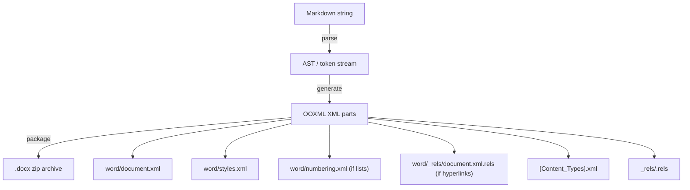

# Design Document: Markdown to DOCX Conversion

## Overview

This feature adds Markdown-to-DOCX export to the mdmarkup extension, the inverse of the existing DOCX-to-Markdown converter. It parses a Markdown document (using the same formatting subset the importer produces) and generates a valid `.docx` zip archive containing OOXML markup. The generated files must open without errors in Microsoft Word, LibreOffice, and Google Docs.

## Architecture



The pipeline: parse Markdown → generate XML parts → zip into `.docx`. Each formatting element maps to specific OOXML constructs documented below.

## OOXML Generation Reference

### DOCX Archive Structure

A minimal valid `.docx` must contain:

| Path | Purpose |
|------|---------|
| `[Content_Types].xml` | Declares MIME types for all parts |
| `_rels/.rels` | Root relationships (points to `word/document.xml`) |
| `word/document.xml` | Main document content |
| `word/styles.xml` | Style definitions (headings, default paragraph/run styles) |
| `word/numbering.xml` | Numbering definitions (only if document contains lists) |
| `word/_rels/document.xml.rels` | Document-level relationships (only if document contains hyperlinks) |

### Run Property Generation (w:rPr)

For each Markdown formatting type, the corresponding OOXML run property element:

| Markdown syntax | OOXML element | Notes |
|----------------|---------------|-------|
| `**bold**` | `<w:b/>` | Bare element (no `w:val`). Omit entirely when not bold. |
| `*italic*` | `<w:i/>` | Bare element. Omit when not italic. |
| `<u>underline</u>` | `<w:u w:val="single"/>` | Explicit `w:val="single"` for interop. 18 ST_Underline values exist but only `single` is needed. |
| `~~strikethrough~~` | `<w:strike/>` | Bare element. Use `w:strike` not `w:dstrike` — Markdown has no double-strikethrough. |
| `==highlight==` | `<w:highlight w:val="yellow"/>` | Use `w:highlight` not `w:shd` for semantic highlighting. `"yellow"` is the default color. ST_HighlightColor has 17 values. |
| `<sup>super</sup>` | `<w:vertAlign w:val="superscript"/>` | NOT a toggle — takes ST_VerticalAlignRun enum: `baseline`, `superscript`, `subscript`. |
| `<sub>sub</sub>` | `<w:vertAlign w:val="subscript"/>` | Same as above. |

When multiple formats are active on a run, emit all applicable elements in a single `w:rPr`. The element order within `w:rPr` should follow OOXML convention (bold, italic, strike, underline, highlight, vertAlign).

### Boolean Toggle Convention (ST_OnOff)

The OOXML `ST_OnOff` type accepts six values: `"true"`, `"false"`, `"on"`, `"off"`, `"1"`, `"0"`. When **generating** DOCX:

- **True**: Emit bare element with no `w:val` attribute (e.g., `<w:b/>`). This is the conventional form.
- **False**: Omit the element entirely. Do not emit `<w:b w:val="false"/>`.

This convention applies to `w:b`, `w:i`, `w:strike` and other toggle properties.

### Heading Generation (w:pStyle)

Markdown headings map to paragraph style references:

```xml
<w:p>
  <w:pPr>
    <w:pStyle w:val="Heading1"/>
  </w:pPr>
  <w:r><w:t>Heading text</w:t></w:r>
</w:p>
```

Use PascalCase `Heading1` through `Heading6` — the conventional English built-in style IDs. These must have corresponding definitions in `word/styles.xml` with appropriate font sizes, spacing, and `w:outlineLvl` values so Word recognizes them in the navigation pane and TOC.

### Numbering Definitions (word/numbering.xml)

Lists require a two-level indirection that cannot be inlined:

```xml
<!-- Abstract definition (reusable template) -->
<w:abstractNum w:abstractNumId="0">
  <w:lvl w:ilvl="0">
    <w:numFmt w:val="bullet"/>
    <!-- Additional level formatting: w:lvlText, w:lvlJc, etc. -->
  </w:lvl>
  <w:lvl w:ilvl="1">
    <w:numFmt w:val="bullet"/>
  </w:lvl>
  <!-- ... up to ilvl="8" for 9 nesting levels -->
</w:abstractNum>

<w:abstractNum w:abstractNumId="1">
  <w:lvl w:ilvl="0">
    <w:numFmt w:val="decimal"/>
  </w:lvl>
  <!-- ... -->
</w:abstractNum>

<!-- Concrete instance referencing the abstract definition -->
<w:num w:numId="1">
  <w:abstractNumId w:val="0"/>
</w:num>

<w:num w:numId="2">
  <w:abstractNumId w:val="1"/>
</w:num>
```

Paragraphs reference the concrete instance:

```xml
<w:pPr>
  <w:numPr>
    <w:ilvl w:val="0"/>
    <w:numId w:val="1"/>
  </w:numPr>
</w:pPr>
```

For bullet lists: `<w:numFmt w:val="bullet"/>`. For ordered lists: `<w:numFmt w:val="decimal"/>` (the standard default among 62 ST_NumberFormat values).

### Hyperlink Relationships

External hyperlinks require two parts:

**1. Relationship entry** in `word/_rels/document.xml.rels`:
```xml
<Relationship
  Id="rId1"
  Type="http://schemas.openxmlformats.org/officeDocument/2006/relationships/hyperlink"
  Target="https://example.com"
  TargetMode="External"/>
```

**2. Hyperlink element** in `word/document.xml`:
```xml
<w:hyperlink r:id="rId1">
  <w:r>
    <w:rPr><!-- optional formatting --></w:rPr>
    <w:t>link text</w:t>
  </w:r>
</w:hyperlink>
```

Each unique URL gets one relationship entry; multiple links to the same URL share the `r:id`. All `r:id` values must be unique across the document's relationships.

Note: OOXML also supports internal bookmark links via `w:anchor` attribute, but these are not needed for Markdown `[text](url)` conversion.

## ECMA-376 Sources

| Topic | URL |
|-------|-----|
| ST_OnOff | https://c-rex.net/samples/ooxml/e1/Part4/OOXML_P4_DOCX_ST_OnOff_topic_ID0EK6C3.html |
| ST_Underline | https://c-rex.net/samples/ooxml/e1/Part4/OOXML_P4_DOCX_ST_Underline_topic_ID0EC323.html |
| ST_HighlightColor | https://schemas.liquid-technologies.com/officeopenxml/2006/st_highlightcolor.html |
| ST_HexColor | http://www.datypic.com/sc/ooxml/t-w_ST_HexColor.html |
| ST_VerticalAlignRun | https://c-rex.net/samples/ooxml/e1/Part4/OOXML_P4_DOCX_vertAlign_topic_ID0EWE4O.html |
| ST_NumberFormat | https://c-rex.net/samples/ooxml/e1/Part4/OOXML_P4_DOCX_ST_NumberFormat_topic_ID0EDNB3.html |
| w:hyperlink | https://ooxml.info/docs/17/17.16/17.16.22/ |
| w:strike / w:dstrike | https://c-rex.net/samples/ooxml/e1/Part4/OOXML_P4_DOCX_strike_topic_ID0EWR1O.html |
| w:highlight priority | https://c-rex.net/samples/ooxml/e1/Part4/OOXML_P4_DOCX_highlight_topic_ID0E13LO.html |
| w:pStyle | https://c-rex.net/samples/ooxml/e1/Part4/OOXML_P4_DOCX_pStyle_topic_ID0E6OIM.html |
| Toggle behavior in styles | https://c-rex.net/samples/ooxml/e1/Part4/OOXML_P4_DOCX_b_topic_ID0EP6EO.html |
