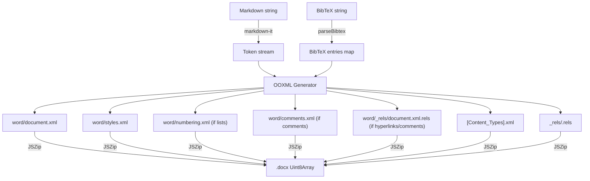

# Design Document: Markdown to DOCX Conversion

## Overview

This feature adds the reverse direction to the existing DOCX-to-Markdown converter, completing the round-trip workflow: DOCX → Markdown (edit in VS Code) → DOCX (submit to journal/collaborators). The converter takes a Markdown string and an optional BibTeX string, parses them into intermediate representations, generates OOXML parts, and packages them into a `.docx` zip archive.

The implementation reuses the project's existing dependencies (`jszip`, `fast-xml-parser`, `markdown-it`) and follows the same architectural patterns as `converter.ts`. A new module `src/md-to-docx.ts` will house the core conversion logic, with a thin VS Code command wrapper in `extension.ts`.

## Architecture



### Pipeline Stages

1. **Parse Markdown** — Use `markdown-it` with custom plugins to tokenize the Markdown into a token stream. Custom inline rules handle CriticMarkup patterns, Pandoc citations, colored highlights, and LaTeX math delimiters.
2. **Parse BibTeX** — A lightweight BibTeX parser extracts entries into a `Map<string, BibtexEntry>` keyed by citation key. It preserves custom fields (`zotero-key`, `zotero-uri`).
3. **Generate OOXML** — Walk the token stream and emit XML strings for each OOXML part. Track state for comments (ID allocation), hyperlinks (relationship IDs), and list numbering.
4. **Package** — Assemble all parts into a zip archive using JSZip and return as `Uint8Array`.

## Components and Interfaces

### Public API

```typescript
// src/md-to-docx.ts

export interface MdToDocxOptions {
  bibtex?: string;           // Optional companion .bib content
  authorName?: string;       // For CriticMarkup attribution fallback
  templateDocx?: Uint8Array; // Optional .docx template for styles
}

export interface MdToDocxResult {
  docx: Uint8Array;          // The .docx zip archive
  warnings: string[];        // Non-fatal issues (e.g., unresolved citation keys)
}

export async function convertMdToDocx(
  markdown: string,
  options?: MdToDocxOptions
): Promise<MdToDocxResult>;
```

### BibTeX Parser

```typescript
// src/bibtex-parser.ts

export interface BibtexEntry {
  type: string;              // e.g., "article", "misc"
  key: string;               // citation key
  fields: Map<string, string>; // field name → value (braces stripped)
  zoteroKey?: string;        // extracted from zotero-key field
  zoteroUri?: string;        // extracted from zotero-uri field
}

export function parseBibtex(input: string): Map<string, BibtexEntry>;
export function serializeBibtex(entries: Map<string, BibtexEntry>): string;
```

### LaTeX-to-OMML Converter

```typescript
// src/latex-to-omml.ts

/** Convert a LaTeX math string to OMML XML string. */
export function latexToOmml(latex: string): string;
```

This is the inverse of the existing `ommlToLatex()` in `src/omml.ts`. It parses a subset of LaTeX math syntax and emits OMML XML elements. Supported constructs:

- Fractions: `\frac{num}{den}` → `m:f`
- Superscripts: `x^{n}` → `m:sSup`
- Subscripts: `x_{i}` → `m:sSub`
- Combined sub/superscripts: `x_{i}^{n}` → `m:sSubSup`
- Square roots: `\sqrt{x}`, `\sqrt[n]{x}` → `m:rad`
- N-ary operators: `\sum`, `\int`, `\prod` with limits → `m:nary`
- Delimiters: `\left( ... \right)` → `m:d`
- Greek letters: `\alpha`, `\beta`, etc. → Unicode in `m:t`
- Accents: `\hat{x}`, `\bar{x}`, etc. → `m:acc`
- Matrices: `\begin{matrix}...\end{matrix}` → `m:m`
- Functions: `\sin`, `\cos`, `\log`, etc. → `m:func`
- Text runs and plain characters → `m:r` / `m:t`

Unsupported constructs fall back to a plain text run containing the raw LaTeX.

### Markdown Parsing Strategy

Use `markdown-it` as the base parser (already a project dependency). Add custom inline rules for:

1. **CriticMarkup** — `{++...++}`, `{--...--}`, `{~~...~>...~~}`, `{==...==}`, `{>>...<<}`
2. **Pandoc citations** — `[@key]`, `[@key, p. 20]`, `[@key1; @key2]`
3. **Colored highlights** — `==text=={color}`
4. **LaTeX math** — `$...$` (inline), `$$...$$` (display)

The token stream from `markdown-it` provides `heading_open`, `paragraph_open`, `bullet_list_open`, `ordered_list_open`, `list_item_open`, `table_open`, `blockquote_open`, `fence`, `code_inline`, `html_inline` (for `<u>`, `<sup>`, `<sub>`), `link_open`, and inline tokens with nesting for bold/italic/strikethrough.

### OOXML Generation

The generator walks the token stream and builds XML strings. It maintains state for:

- **Comment counter** — Monotonically increasing IDs for `w:commentRangeStart`/`w:commentRangeEnd` and `word/comments.xml` entries.
- **Relationship registry** — Maps URLs to `r:id` values. Deduplicates URLs so each unique URL gets one relationship entry.
- **List state** — Tracks whether we're inside a bullet or ordered list and the nesting level, mapping to `w:numId` and `w:ilvl`.
- **Revision state** — When inside CriticMarkup additions/deletions, wraps runs in `w:ins`/`w:del` elements with author and date attributes.

### OOXML Part Templates

Static XML templates for the boilerplate parts:

- `[Content_Types].xml` — Declares MIME types. Conditionally includes entries for `numbering.xml` and `comments.xml`.
- `_rels/.rels` — Root relationships pointing to `word/document.xml`.
- `word/styles.xml` — Defines `Normal`, `Heading1`–`Heading6`, `Hyperlink`, `Quote`, `CodeChar`, and `CodeBlock` styles. When a template DOCX is provided, this file is extracted from the template instead of using defaults.
- `word/numbering.xml` — Two `w:abstractNum` definitions (bullet and decimal) with 9 levels each, plus corresponding `w:num` entries.

### Template-Based Export

When the user provides a template `.docx` file, the converter extracts styling parts from it:

1. `word/styles.xml` — Replaces the default styles entirely, so headings, body text, and other elements inherit the template's fonts, sizes, colors, and spacing.
2. `word/theme1.xml` — If present, included in the output for theme colors and fonts.
3. `word/numbering.xml` — If present, used as the base for list definitions (the converter merges its bullet/decimal definitions if not already present).
4. `word/settings.xml` — If present, included for document-level settings (margins, page size, etc.).

The template's `word/document.xml` is ignored — only styling/settings parts are extracted. This ensures the template controls appearance while the Markdown controls content.

### Run Property Generation

For each text token with formatting flags, emit `w:rPr` children in OOXML-conventional order:

| Priority | Element | Condition |
|----------|---------|-----------|
| 1 | `<w:rStyle w:val=\"CodeChar\"/>` | inline code (references a character style in styles.xml) |
| 2 | `<w:b/>` | bold |
| 3 | `<w:i/>` | italic |
| 4 | `<w:strike/>` | strikethrough |
| 5 | `<w:u w:val=\"single\"/>` | underline |
| 6 | `<w:highlight w:val=\"{color}\"/>` | highlight (default \"yellow\") |
| 7 | `<w:vertAlign w:val=\"superscript\"/>` | superscript |
| 8 | `<w:vertAlign w:val=\"subscript\"/>` | subscript (mutually exclusive with superscript) |

Boolean toggles use bare elements (no `w:val` attribute) for true, and are omitted entirely for false, per ST_OnOff convention.

### CriticMarkup → OOXML Mapping

| CriticMarkup | OOXML |
|-------------|-------|
| `{++text++}` | `<w:ins w:author="..." w:date="..."><w:r>...<w:t>text</w:t></w:r></w:ins>` |
| `{--text--}` | `<w:del w:author="..." w:date="..."><w:r>...<w:delText>text</w:delText></w:r></w:del>` |
| `{~~old~>new~~}` | `<w:del>...<w:delText>old</w:delText>...</w:del><w:ins>...<w:t>new</w:t>...</w:ins>` |
| `{==text==}{>>author (date): comment<<}` | `<w:commentRangeStart/>` ... text runs ... `<w:commentRangeEnd/><w:r><w:commentReference/></w:r>` + entry in `word/comments.xml` |
| `{>>comment<<}` (standalone) | Zero-width comment anchor at position |

Author attribution is parsed from the comment text when present (`author (ISO-date): comment`). When absent, falls back to the configured `scimark.authorName` setting or OS username, with current timestamp.

### Pandoc Citation → OOXML Mapping

When BibTeX with Zotero metadata is available:

```xml
<!-- Complex field code for Zotero -->
<w:r><w:fldChar w:fldCharType="begin"/></w:r>
<w:r><w:instrText> ADDIN ZOTERO_ITEM CSL_CITATION {...JSON...} </w:instrText></w:r>
<w:r><w:fldChar w:fldCharType="separate"/></w:r>
<w:r><w:t>(Author Year)</w:t></w:r>
<w:r><w:fldChar w:fldCharType="end"/></w:r>
```

The CSL_CITATION JSON is reconstructed from BibTeX fields, mapping standard BibTeX fields back to CSL-JSON (`author` → `author[]`, `title` → `title`, `journal` → `container-title`, etc.). The `zotero-key` and `zotero-uri` fields are placed into `citationItems[].uris`.

When Zotero metadata is not available, emit plain text: `(Author Year)` or `(key)`.

### Table → OOXML Mapping

```xml
<w:tbl>
  <w:tblPr>
    <w:tblBorders><!-- single borders --></w:tblBorders>
    <w:tblW w:w="0" w:type="auto"/>
  </w:tblPr>
  <w:tr><!-- header row -->
    <w:tc><w:p><w:r><w:t>Header</w:t></w:r></w:p></w:tc>
  </w:tr>
  <w:tr><!-- data rows -->
    <w:tc><w:p><w:r><w:t>Cell</w:t></w:r></w:p></w:tc>
  </w:tr>
</w:tbl>
```

Header row cells get bold formatting. Table borders use `<w:tblBorders>` with `single` style for consistent rendering.

## Data Models

### BibtexEntry

```typescript
interface BibtexEntry {
  type: string;                    // "article", "book", "misc", etc.
  key: string;                     // citation key (e.g., "smith2020effects")
  fields: Map<string, string>;     // field name → value
  zoteroKey?: string;              // from zotero-key field
  zoteroUri?: string;              // from zotero-uri field
}
```

### OOXML Generation State

```typescript
interface DocxGenState {
  commentId: number;               // next comment ID to allocate
  comments: CommentEntry[];        // accumulated comment entries
  relationships: Map<string, string>; // URL → rId
  nextRId: number;                 // next relationship ID counter
  warnings: string[];              // non-fatal issues
  hasList: boolean;                // whether numbering.xml is needed
  hasComments: boolean;            // whether comments.xml is needed
  templateParts?: Map<string, Uint8Array>; // extracted template parts (styles.xml, theme1.xml, etc.)
}

interface CommentEntry {
  id: number;
  author: string;
  date: string;                    // ISO 8601
  text: string;
}
```

### CSL-JSON Reconstruction

For Zotero field code reconstruction, BibTeX fields map to CSL-JSON:

| BibTeX field | CSL-JSON field |
|-------------|---------------|
| `author` | `author` (parsed into `{family, given}` objects) |
| `title` | `title` |
| `journal` | `container-title` |
| `volume` | `volume` |
| `pages` | `page` |
| `year` | `issued.date-parts[0][0]` |
| `doi` | `DOI` |
| `type` (entry type) | `type` (mapped: article→article-journal, book→book, etc.) |


## Correctness Properties

*A property is a characteristic or behavior that should hold true across all valid executions of a system — essentially, a formal statement about what the system should do. Properties serve as the bridge between human-readable specifications and machine-verifiable correctness guarantees.*

### Property 1: Markdown parser round-trip

*For any* valid Markdown token stream containing supported syntax elements (paragraphs, headings, formatting, lists, CriticMarkup, citations, math, tables, blockquotes, code), pretty-printing the token stream and then parsing the result SHALL produce a semantically equivalent token stream.

**Validates: Requirements 1.1, 1.2, 1.3, 1.4**

### Property 2: BibTeX parser round-trip

*For any* valid BibTeX entry with standard fields and optional `zotero-key`/`zotero-uri` custom fields, parsing the BibTeX string and then serializing the result SHALL produce a semantically equivalent BibTeX string (field values preserved, whitespace differences allowed).

**Validates: Requirements 9.6, 9.7**

### Property 3: DOCX archive completeness

*For any* Markdown document, the output `.docx` archive SHALL contain `[Content_Types].xml`, `_rels/.rels`, `word/document.xml`, and `word/styles.xml`. Additionally, if the document contains lists then `word/numbering.xml` SHALL be present, if it contains hyperlinks then `word/_rels/document.xml.rels` SHALL be present with relationship entries, and if it contains comments then `word/comments.xml` SHALL be present.

**Validates: Requirements 2.1, 2.2, 2.3, 2.4**

### Property 4: Character formatting preservation

*For any* text string and any combination of formatting flags (bold, italic, underline, strikethrough, highlight, superscript, subscript), the generated `w:rPr` element SHALL contain exactly the OOXML elements corresponding to the active flags and no others. Colored highlights SHALL use the specified ST_HighlightColor value.

**Validates: Requirements 3.1, 3.2, 3.3, 3.4, 3.5, 3.6, 3.7, 3.8, 3.9**

### Property 5: Heading level mapping

*For any* heading level N (1–6) and any text content (optionally with formatting), the generated paragraph SHALL contain `<w:pStyle w:val="HeadingN"/>` and the text runs SHALL preserve all active formatting.

**Validates: Requirements 4.1, 4.3**

### Property 6: List numbering and nesting

*For any* list item (bulleted or ordered) at any nesting level, the generated paragraph SHALL contain `w:numPr` with the correct `w:numId` (bullet vs. decimal) and `w:ilvl` matching the nesting depth.

**Validates: Requirements 5.1, 5.2, 5.3**

### Property 7: Hyperlink deduplication and structure

*For any* Markdown document containing hyperlinks, each unique URL SHALL produce exactly one relationship entry in `document.xml.rels`, and each `w:hyperlink` element SHALL reference a valid `r:id`. Formatted text within hyperlinks SHALL have correct run properties.

**Validates: Requirements 6.1, 6.2, 6.3**

### Property 8: CriticMarkup revision elements

*For any* CriticMarkup addition `{++text++}`, the output SHALL contain a `w:ins` element with the text. *For any* deletion `{--text--}`, the output SHALL contain a `w:del` element with `w:delText`. *For any* substitution `{~~old~>new~~}`, the output SHALL contain a `w:del` for the old text followed by a `w:ins` for the new text. When author attribution is present, `w:author` and `w:date` attributes SHALL match.

**Validates: Requirements 7.1, 7.2, 7.3, 7.4**

### Property 9: Comment ID consistency

*For any* Markdown document containing CriticMarkup comments, each comment SHALL have a unique numeric ID, and the ID SHALL appear consistently in `w:commentRangeStart`, `w:commentRangeEnd`, `w:commentReference` in the document body, and the corresponding entry in `word/comments.xml` with correct author and date.

**Validates: Requirements 8.1, 8.2, 8.4**

### Property 10: Zotero field code reconstruction

*For any* Pandoc citation `[@key]` (with optional locator and multi-key grouping) where the BibTeX entry contains `zotero-key` and `zotero-uri` fields, the output SHALL contain a `ZOTERO_ITEM CSL_CITATION` complex field code with `citationItems` entries containing the correct URIs, and locators when present. Multiple citations in a single bracket SHALL produce a single field code with multiple `citationItems`.

**Validates: Requirements 9.1, 9.2, 9.4, 9.5**

### Property 11: LaTeX-to-OMML round-trip

*For any* LaTeX math expression using supported constructs (fractions, superscripts, subscripts, roots, n-ary operators, delimiters, Greek letters, accents, matrices, functions), converting to OMML and then back to LaTeX using the existing `ommlToLatex()` SHALL produce a semantically equivalent LaTeX string.

**Validates: Requirements 10.1, 10.2, 10.3**

### Property 12: Table structure

*For any* pipe-delimited Markdown table with N columns and M data rows, the output SHALL contain a `w:tbl` element with M+1 `w:tr` rows (header + data), each containing N `w:tc` cells. The header row cells SHALL have bold formatting. Formatted text within cells SHALL have correct run properties.

**Validates: Requirements 11.1, 11.2, 11.3**

### Property 13: Blockquote indentation

*For any* blockquote at nesting level L (1-based), the generated paragraph SHALL have indentation proportional to L, with deeper nesting producing greater indentation.

**Validates: Requirements 12.1, 12.2**

### Property 14: Code style references

*For any* inline code span, the generated run SHALL reference a character style (e.g., `CodeChar`) defined in `word/styles.xml`. *For any* fenced code block, the generated paragraphs SHALL reference a paragraph style (e.g., `CodeBlock`) defined in `word/styles.xml`.

**Validates: Requirements 13.1, 13.2**

### Property 15: Full MD→DOCX→MD round-trip

*For any* Markdown document containing supported formatting (bold, italic, underline, strikethrough, highlight, colored highlight, superscript, subscript, hyperlinks, headings, bullet lists, numbered lists, CriticMarkup additions/deletions, and Pandoc citations with Zotero BibTeX), converting to DOCX and then back to Markdown using the existing `convertDocx()` SHALL produce semantically equivalent Markdown.

**Validates: Requirements 15.1, 15.2, 15.3**

## Error Handling

| Scenario | Behavior |
|----------|----------|
| Unresolved citation key (`[@unknown]`) | Emit plain text `[@unknown]`, add warning to `MdToDocxResult.warnings` |
| BibTeX parse error | Skip malformed entries, add warning, continue with remaining entries |
| Unsupported LaTeX construct | Emit fallback text run with raw LaTeX string |
| Invalid highlight color in `==text=={badcolor}` | Fall back to `yellow` (default highlight color) |
| Empty Markdown input | Produce a valid minimal DOCX with an empty document body |
| Malformed CriticMarkup (unclosed patterns) | Treat as literal text, do not emit revision/comment elements |
| BibTeX entry missing required fields | Use available fields, leave missing CSL-JSON fields empty |

## Testing Strategy

### Dual Testing Approach

Both unit tests and property-based tests are required for comprehensive coverage.

**Unit tests** focus on:
- Specific examples demonstrating correct OOXML output for each formatting type
- Edge cases: empty documents, unclosed CriticMarkup, malformed BibTeX, unsupported LaTeX
- Integration points: VS Code command registration, file I/O, output conflict handling
- Static invariants: styles.xml content, Content_Types.xml declarations

**Property-based tests** focus on:
- Universal properties that hold across all valid inputs (Properties 1–15 above)
- Comprehensive input coverage through randomized generation

### Property-Based Testing Configuration

- Library: `fast-check` (already a project devDependency)
- Minimum 100 iterations per property test
- Use bounded generators to avoid timeouts (per AGENTS.md learning: "prefer shorter bounded generators")
- Each test tagged with: **Feature: md-to-docx-conversion, Property {N}: {title}**
- Each correctness property implemented as a single property-based test

### Test File Organization

- `src/md-to-docx.test.ts` — Unit tests for the core converter
- `src/md-to-docx.property.test.ts` — Property-based tests for Properties 1–15
- `src/bibtex-parser.test.ts` — Unit tests for BibTeX parsing
- `src/latex-to-omml.test.ts` — Unit tests for LaTeX-to-OMML conversion

### Key Test Generators

- **Markdown generator**: Produces random Markdown documents with configurable feature flags (formatting, lists, headings, CriticMarkup, citations, math, tables)
- **BibTeX generator**: Produces random BibTeX entries with optional Zotero fields
- **LaTeX generator**: Produces random LaTeX math expressions using supported constructs
- **Formatting flags generator**: Produces random combinations of boolean formatting flags

All generators should use `fc.string({ minLength: 1, maxLength: 50 })` or similar bounded constraints to keep test execution fast.
