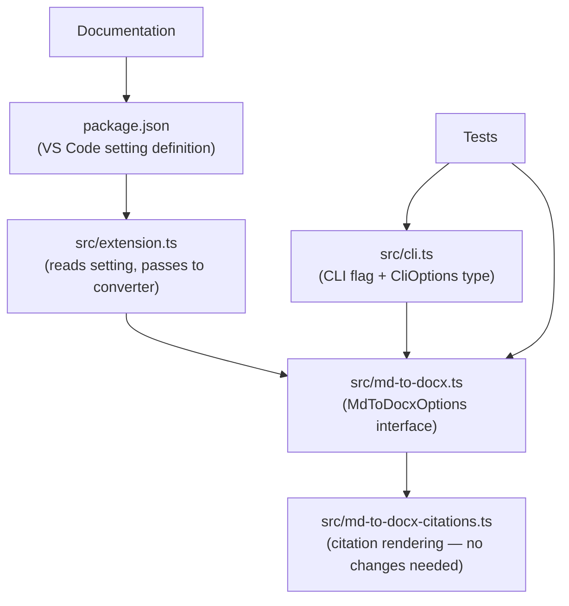

# Design Document: Remove Mixed Citation Style Setting

## Overview

This design covers the complete removal of the `manuscriptMarkdown.mixedCitationStyle` setting from the Manuscript Markdown extension. The setting was introduced to control how mixed Zotero/non-Zotero grouped citations render — `"separate"` (each portion in its own parentheses) vs `"unified"` (one set of parentheses). After the Zotero citation mismatch fix (PR #113), non-Zotero entries use string IDs and synthetic URIs, making unified style always work correctly. Additionally, the setting was non-functional — the converter always produced unified output regardless of the setting value.

The removal touches seven areas: VS Code setting definition (`package.json`), converter API (`src/md-to-docx.ts`), extension host code (`src/extension.ts`), CLI (`src/cli.ts`), tests, documentation, and internal comments.

## Architecture

This is a pure subtraction change — no new components or interfaces are introduced. The removal follows the dependency chain:



Key observation: `mixedCitationStyle` is declared in `MdToDocxOptions` but never actually read by the converter logic in `md-to-docx-citations.ts`. The converter always produces unified output. This confirms the setting was dead code from the consumer side.

## Components and Interfaces

### Files to Modify

| File | Change | Rationale |
|------|--------|-----------|
| `package.json` | Remove `manuscriptMarkdown.mixedCitationStyle` from `contributes.configuration` | Req 1 |
| `src/md-to-docx.ts` | Remove `mixedCitationStyle` property from `MdToDocxOptions` interface | Req 2 |
| `src/extension.ts` | Remove `config.get('mixedCitationStyle', ...)` call and stop passing it to `convertMdToDocx` | Req 3 |
| `src/cli.ts` | Remove from `CliOptions` interface, `parseArgs` defaults, flag parsing, `showHelp`, and `runMdToDocx` passthrough | Req 4 |
| `src/cli.test.ts` | Remove `mixedCitationStyle` from Property 2 generator and assertions, remove default assertion, remove invalid-style test, remove from missing-value flags list | Req 5 |
| `src/csl-citations.test.ts` | Remove `mixedCitationStyle: 'unified'` from the mixed group test options | Req 5 |
| `src/converter.ts` | Remove comment referencing `mixedCitationStyle` | Req 7 |
| `docs/configuration.md` | Remove row from Citations table | Req 6 |
| `docs/zotero-roundtrip.md` | Remove `mixedCitationStyle` subsection, update Mixed Citations prose | Req 6 |
| `docs/converter.md` | Remove `mixedCitationStyle` reference from Citations bullet | Req 6 |

### Files NOT Modified

| File | Reason |
|------|--------|
| `src/md-to-docx-citations.ts` | Never consumed the option — already produces unified output |

## Data Models

### Before (removed)

```typescript
// In MdToDocxOptions (src/md-to-docx.ts)
mixedCitationStyle?: 'separate' | 'unified';

// In CliOptions (src/cli.ts)
mixedCitationStyle: 'separate' | 'unified';
```

### After

Both properties are deleted. The converter always produces unified-style output for mixed citation groups — this is the existing runtime behavior, now made explicit by removing the unused configuration surface.


## Correctness Properties

*A property is a characteristic or behavior that should hold true across all valid executions of a system — essentially, a formal statement about what the system should do. Properties serve as the bridge between human-readable specifications and machine-verifiable correctness guarantees.*

This is a removal spec. Most acceptance criteria verify the absence of code, types, or documentation — these are compile-time or code-review concerns, not runtime properties. The testable criteria are all specific examples rather than universally quantified properties over random inputs. This is expected: removing a feature means verifying specific things are gone, not that a rule holds across all inputs.

### Property 1: CLI rejects removed flag as unknown

*For any* CLI invocation that includes `--mixed-citation-style`, the argument parser should throw an "Unknown option" error, treating it identically to any other unrecognized flag.

**Validates: Requirements 4.1, 4.3**

### Property 2: Mixed citation groups produce unified output without configuration

*For any* mixed citation group containing both Zotero-linked and plain BibTeX entries, the converter should produce a single unified field code without accepting a `mixedCitationStyle` parameter.

**Validates: Requirements 2.2, 5.3**

## Error Handling

No new error handling is introduced. The only behavioral change is that the CLI argument parser will now reject `--mixed-citation-style` as an unknown flag (the existing `Unknown option` error path handles this automatically once the flag parsing code is removed).

Users who have `manuscriptMarkdown.mixedCitationStyle` in their VS Code `settings.json` will see no error — VS Code silently ignores unknown settings. The setting simply becomes inert.

## Testing Strategy

### Property-Based Testing

This removal spec has no universally quantified properties suitable for property-based testing. The existing property tests in `src/cli.test.ts` (Property 2: Argument parser preserves all flag values) must be updated to remove `mixedCitationStyle` from the generator and assertions — this is a test maintenance task, not a new property test.

Library: `fast-check` (already used throughout the project).

### Unit Tests

The following specific example tests verify the removal:

1. **CLI rejects `--mixed-citation-style`**: Pass the flag to `parseArgs` and assert it throws `Unknown option "--mixed-citation-style"`. This replaces the existing "invalid mixed citation style" test.
   - Tag: **Feature: remove-mixed-citation-style, Property 1: CLI rejects removed flag as unknown**

2. **Mixed group produces unified output**: Call `convertMdToDocx` with a mixed citation group (no `mixedCitationStyle` in options) and verify the output contains a single `ZOTERO_ITEM CSL_CITATION` field code with both entries. This updates the existing test in `src/csl-citations.test.ts`.
   - Tag: **Feature: remove-mixed-citation-style, Property 2: Mixed citation groups produce unified output without configuration**

3. **Compilation check**: TypeScript compilation (`bun run compile`) must succeed after all removals, confirming no code references the deleted interface property or CLI option type.

### Existing Tests to Modify

| Test File | Change |
|-----------|--------|
| `src/cli.test.ts` Property 2 | Remove `fc.constantFrom('separate', 'unified')` generator, remove `--mixed-citation-style` from args construction, remove `mixedCitationStyle` assertion |
| `src/cli.test.ts` defaults test | Remove `expect(result.mixedCitationStyle).toBe('separate')` |
| `src/cli.test.ts` invalid style test | Remove entirely (flag no longer exists) |
| `src/cli.test.ts` missing values test | Remove `'--mixed-citation-style'` from `valueFlags` array |
| `src/csl-citations.test.ts` mixed group test | Remove `mixedCitationStyle: 'unified'` from options, update test name |
