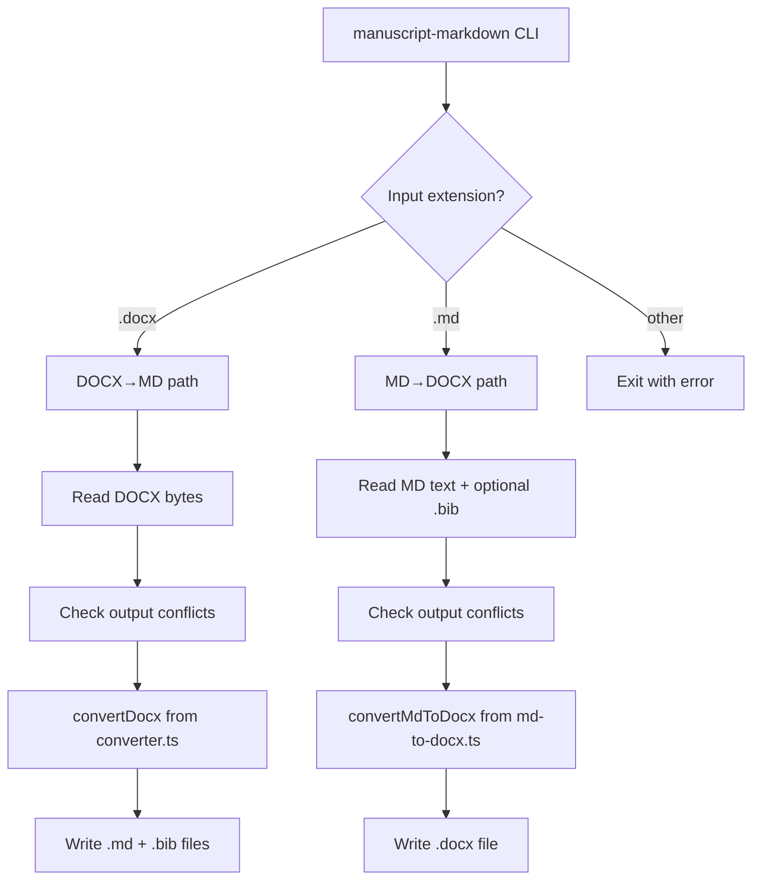

# Design Document: Standalone CLI Tools

## Overview

A single CLI binary `manuscript-markdown` that provides DOCX↔Markdown conversion from any terminal, reusing the existing `converter.ts` (DOCX→MD) and `md-to-docx.ts` (MD→DOCX) library code. The conversion direction is auto-detected from the input file extension. The binary is compiled via `bun build --compile` and installed to `~/bin` by `setup.sh`.

The CLI is a thin wrapper: it parses arguments, reads files, calls the existing async conversion functions, writes output, and reports results/errors. No conversion logic is duplicated.

## Architecture



The CLI entry point is a single file `src/cli.ts` that:
1. Parses argv using a minimal hand-rolled parser (no external dep needed for this flag set)
2. Dispatches to the appropriate conversion path
3. Handles output conflict detection and `--force` logic
4. Prints output paths to stdout, warnings/errors to stderr

## Components and Interfaces

### CLI Entry Point (`src/cli.ts`)

Single module exporting nothing (top-level script). Responsibilities:

- Parse `process.argv` into a typed options object
- Validate input file existence and extension
- Dispatch to `runDocxToMd()` or `runMdToDocx()` internal functions
- Handle `--help` and `--version` early-exit flags
- Exit with code 0 on success, non-zero on error

### Argument Parser

Hand-rolled parser (no dependency). Parses these flags:

| Flag | Applies to | Type | Default |
|------|-----------|------|---------|
| `--help` | both | boolean | — |
| `--version` | both | boolean | — |
| `--output <path>` | both | string | derived from input |
| `--force` | both | boolean | false |
| `--citation-key-format <fmt>` | DOCX→MD | enum | `authorYearTitle` |
| `--bib <path>` | MD→DOCX | string | auto-detect |
| `--template <path>` | MD→DOCX | string | none |
| `--author <name>` | MD→DOCX | string | OS username |
| `--mixed-citation-style <style>` | MD→DOCX | enum | `separate` |
| `--csl-cache-dir <path>` | MD→DOCX | string | `~/.manuscript-markdown/csl-cache` |

The positional argument is the input file path.

### DOCX→MD Flow (`runDocxToMd`)

```typescript
async function runDocxToMd(inputPath: string, opts: CliOptions): Promise<void>
```

1. Read input file as `Uint8Array` via `fs.readFileSync`
2. Compute output base path (from `--output` or input basename without `.docx`)
3. Check if `{base}.md` and/or `{base}.bib` exist; if conflicts and no `--force`, exit with error listing all conflicts
4. Call `convertDocx(data, opts.citationKeyFormat)` from `converter.ts`
5. Write `.md` file; write `.bib` file only if bibtex content is non-empty
6. Print written file paths to stdout

### MD→DOCX Flow (`runMdToDocx`)

```typescript
async function runMdToDocx(inputPath: string, opts: CliOptions): Promise<void>
```

1. Read input `.md` file as UTF-8 string
2. Auto-detect companion `.bib` file (same basename) unless `--bib` overrides
3. If `--bib` specified, read that file; if auto-detected, read it
4. If `--template` specified, read template DOCX as `Uint8Array`
5. Compute output path (from `--output` or input basename with `.docx`)
6. Check if output exists; if conflict and no `--force`, exit with error
7. Resolve author: `--author` flag → `os.userInfo().username` fallback
8. Build `MdToDocxOptions` object:
   - `bibtex`: bib file content (if any)
   - `authorName`: resolved author
   - `templateDocx`: template bytes (if any)
   - `cslCacheDir`: from flag or default
   - `sourceDir`: directory of input file (for relative CSL path resolution)
   - `onStyleNotFound`: auto-download (return `true`) since CLI has no interactive prompt
   - `mixedCitationStyle`: from flag or default
9. Call `convertMdToDocx(markdown, options)` from `md-to-docx.ts`
10. Write `.docx` output
11. Print warnings to stderr, output path to stdout

### VS Code Dependency Isolation

The existing `converter.ts` and `md-to-docx.ts` do NOT import `vscode` — they are pure library code. The `author.ts` module does import `vscode`, but the CLI handles author name resolution independently (via `--author` flag or `os.userInfo()`), so no changes to `author.ts` are needed.

The CLI entry point must NOT import any module that transitively imports `vscode`. The converter modules are safe.


## Data Models

### CliOptions

```typescript
interface CliOptions {
  inputPath: string;
  outputPath?: string;          // --output
  force: boolean;               // --force
  // DOCX→MD specific
  citationKeyFormat: 'authorYearTitle' | 'authorYear' | 'numeric';
  // MD→DOCX specific
  bibPath?: string;             // --bib
  templatePath?: string;        // --template
  authorName?: string;          // --author
  mixedCitationStyle: 'separate' | 'unified';
  cslCacheDir: string;          // --csl-cache-dir
}
```

No new persistent data models. The CLI is stateless — it reads input, converts, writes output.

### Output Path Derivation

- DOCX→MD: `{dir}/{basename}.md` and `{dir}/{basename}.bib` where `{basename}` is the input filename without `.docx`
- MD→DOCX: `{dir}/{basename}.docx` where `{basename}` is the input filename without `.md`
- When `--output` is provided, it replaces the derived base path (for DOCX→MD) or full output path (for MD→DOCX)

### Build Configuration

The CLI is compiled with `bun build`:
```bash
bun build src/cli.ts --compile --outfile dist/manuscript-markdown
```

This produces a single self-contained executable with all dependencies bundled. The `setup.sh` script copies it to `~/bin/manuscript-markdown`.

A separate `tsconfig.cli.json` is NOT needed — the CLI source uses the same compiler settings. The `bun build --compile` step handles bundling independently of `tsc`.

## Correctness Properties

*A property is a characteristic or behavior that should hold true across all valid executions of a system — essentially, a formal statement about what the system should do. Properties serve as the bridge between human-readable specifications and machine-verifiable correctness guarantees.*

### Property 1: Extension-based dispatch correctness
*For any* input file path ending in `.docx`, the CLI shall dispatch to the DOCX→MD converter. *For any* input file path ending in `.md`, the CLI shall dispatch to the MD→DOCX converter. *For any* other extension, the CLI shall report an error.
**Validates: Requirements 5.1, 5.2**

### Property 2: Argument parser preserves all flag values
*For any* valid combination of CLI flags and values, `parseArgs` shall produce a `CliOptions` object where each flag's value matches the input. When optional flags are omitted, the defaults shall be `authorYearTitle` for citation key format, `separate` for mixed citation style, and `~/.manuscript-markdown/csl-cache` for CSL cache directory.
**Validates: Requirements 1.2, 1.3, 2.3, 2.4, 2.5, 2.8, 2.9, 4.3, 4.4**

### Property 3: Output path derivation with --output override
*For any* input file path, when `--output` is not provided, the output path shall be derived by replacing the input extension. When `--output` is provided, the specified path shall be used instead of the derived path.
**Validates: Requirements 1.4, 2.7**

### Property 4: Conflict detection respects --force
*For any* set of existing output file paths, when `--force` is false the conflict checker shall report a conflict, and when `--force` is true it shall allow the operation to proceed.
**Validates: Requirements 3.1, 3.2**

### Property 5: Dual conflict reporting for DOCX→MD
*For any* DOCX→MD conversion where both `.md` and `.bib` output files already exist, the conflict error message shall reference both files.
**Validates: Requirements 3.3**

### Property 6: Author name resolution
*For any* invocation with `--author <name>`, the resolved author shall equal `<name>`. *For any* invocation without `--author`, the resolved author shall equal the OS username.
**Validates: Requirements 2.5, 2.6**

## Error Handling

| Scenario | Behavior |
|----------|----------|
| Input file does not exist | Exit code 1, stderr: `Error: File not found: <path>` |
| Input file has unsupported extension | Exit code 1, stderr: `Error: Unsupported file type "<ext>". Use .docx or .md` |
| Output conflict without `--force` | Exit code 1, stderr: conflict message listing affected files |
| Invalid `--citation-key-format` value | Exit code 1, stderr: `Error: Invalid citation key format "<val>". Use authorYearTitle, authorYear, or numeric` |
| Invalid `--mixed-citation-style` value | Exit code 1, stderr: `Error: Invalid mixed citation style "<val>". Use separate or unified` |
| DOCX file is corrupt/unreadable | Exit code 1, stderr: error from converter library |
| CSL style download fails | Warning to stderr, conversion continues without CSL formatting (exit code 0) |
| BibTeX file specified but not found | Exit code 1, stderr: `Error: BibTeX file not found: <path>` |
| Template DOCX not found | Exit code 1, stderr: `Error: Template file not found: <path>` |
| Unknown flag | Exit code 1, stderr: `Error: Unknown option "<flag>"` + usage hint |

All errors go to stderr. Successful output paths go to stdout. Warnings (e.g., CSL download failure) go to stderr but do not change the exit code.

## Testing Strategy

### Property-Based Tests (fast-check)

Each correctness property maps to a property-based test using `fast-check` (already a devDependency). Tests go in `src/cli.test.ts`.

Configuration: minimum 100 iterations per property test. Each test tagged with:
```
Feature: standalone-cli-tools, Property N: <title>
```

Property tests focus on the argument parser and dispatch logic (pure functions), not on file I/O. The argument parser is extracted as a pure function `parseArgs(argv: string[]): CliOptions` to enable direct property testing.

### Unit Tests

Unit tests cover:
- `parseArgs` with specific flag combinations and edge cases
- Output path derivation logic
- Conflict detection integration with existing `output-conflicts.ts`
- Help and version output content
- Error messages for invalid inputs

### Integration Tests

A small set of integration tests using real DOCX/MD fixture files to verify end-to-end conversion via the CLI. These test the wiring between argument parsing, file I/O, and converter calls.

### Test Framework

- `bun test` (already configured)
- `fast-check` for property-based tests (already in devDependencies)
